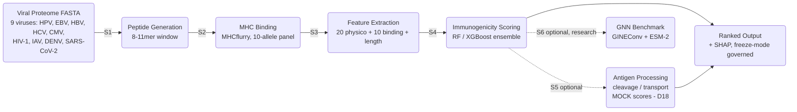

# SESTRAV Architecture

**Structural Epitope Scoring via TCR Recognition And Vaccinology**

This document is the authoritative reference for the current (v2.0) architecture of
SESTRAV: the end-to-end data flow, the two model tracks, the feature representation,
the data-governance layer, and the reproducibility and security posture. It is written
for bioinformatics and computational-immunology reviewers who want to evaluate, run, or
extend the pipeline.

> This document is the current authoritative architecture reference. It supersedes
> earlier, course-era design notes that predate the v2.0 redesign.

---

## 1. Scope and design goals

SESTRAV is a **dry-lab (purely computational) pipeline** for prioritizing viral CD8+
T-cell epitopes by predicted immunogenicity, with a primary focus on HPV and EBV and
trained coverage across additional viruses. It does not perform, simulate, or claim
wet-lab efficacy; every metric in this repository is a computational evaluation against
labeled or held-out data.

The design addresses one specific gap. Most public tools predict peptide-MHC binding,
which is a necessary but weak proxy for immunogenicity (binding affinity used directly
yields AUC near 0.60). SESTRAV combines multi-allele presentation scores with the
physicochemical structure of TCR-contact residues (positions p4-p8, following Chowell
et al. 2015), and trains on experimentally curated IEDB immunogenicity evidence.

**Corrected 2026-08-15. This paragraph used to say SESTRAV adds physicochemical signal
"on top of" multi-allele presentation. The only increment this repository actually
measures runs the other way.** On the v5 corpus under a peptide-grouped splitter, adding
the ten allele binding scores to a binding-free physicochemical floor moves AUC-PR from
0.505 to 0.606 and AUC-ROC from 0.712 to 0.814 (mode-21 to mode-31,
`models/v5/training_results_ablation.csv`; the two feature sets differ by exactly those
ten columns and nothing else). Random Forest importance agrees: the binding block holds
55.8% of total against 41.7% for the physicochemical block and 2.5% for length
(`models/v5/feature_importances.csv`). **The converse is not measured.** That ablation
has no binding-only arm, so what the physicochemical features add over binding alone is
unquantified on this corpus - see `docs/paper.md` Section 4, which already discloses the
same gap. Do not restore an additive framing in either direction without an arm that
measures it.

Three properties are treated as first-class requirements, not afterthoughts:

1. **Reproducibility.** A single Snakemake DAG, version-pinned dependencies with hashes,
   committed datasets and binding matrices, and a freeze mode for release-grade runs.
2. **Auditable data governance.** Cryptographic manifests, a quarantine mechanism for
   label conflicts, and explicit provenance back to IEDB and the curated literature.
3. **Honest model gating.** A model becomes the canonical scorer only after it clears
   published quantitative gates. The current canonical scorer is the Random Forest
   ensemble; the GNN is a research track until it clears its gates.

---

## 2. System overview

SESTRAV is organized as **two model tracks over one shared feature and data substrate**,
all driven by the same Snakemake workflow.

| Track | Model | Status | Role |
|---|---|---|---|
| Production | Random Forest / XGBoost ensemble on the 31-feature representation (`mode_31`) | Validated, maintained | Canonical immunogenicity scorer used for ranked output |
| Research | GNN: GINEConv x2 + ESM-2 residue embeddings, fused with mode-31 features | Gated (v5 run 2026-08-13 under `PeptideGroupedKFold`: Gates 1 and 2 FAIL on measured values, Gates 3, 4 and 5 PASS - see 6.3. The separately tracked v4-era OOF artifact still fails Gate 1 by precondition) | Forward v2.0 architecture; promoted to canonical only on clearing all gates |

Both tracks consume the same physicochemical feature pipeline and the same governed
training data, which keeps comparisons fair and lets the GNN reuse the production
feature engineering rather than relearning it.

---

## 3. Pipeline stages

SESTRAV proceeds through six computational stages under a reproducible Snakemake DAG
(`pipeline.smk`, driven by `config.yaml`). Stages 5 and 6 are optional.

| Stage | Input | Process | Output |
|---|---|---|---|
| 1. Peptide generation | Viral proteome FASTA | Sliding-window 8-11mer extraction | `{proteome}_peptides.csv` |
| 2. MHC binding | Peptides + allele panel | MHCflurry 2.2.1 presentation scores, 10 HLA alleles (pinned, CI-gated) | `{proteome}_binding.csv` |
| 3. Feature extraction | Binding CSV | `src/features.py`: 20 physicochemical properties at p4-p8 + 10 per-allele binding + peptide length | `{proteome}_features.csv` |
| 4. Immunogenicity scoring | Features + serialized model | RF / XGBoost ensemble; SHAP attribution; conformal intervals | `{proteome}_ranked.csv` |
| 5. Antigen processing (optional) | Peptides | Cleavage + transport scores joined as features (`mode_33`). **The shipped cache holds MOCK values, not real NetChop 3.1 / TAPreg output** (`docs/claims_register.md` D18) | extended feature cache |
| 6. GNN benchmark (optional, research) | Peptide graphs + ESM-2 cache | GINEConv + ESM-2 scoring, fused with mode-31 features | GNN OOF predictions, eval JSON |

Binding prediction is modular: MHCflurry is the primary, pip-installable backend; a
NetMHCpan backend can be swapped into the same Stage 2 rule once an academic license is
available, feeding identical downstream stages.

**Scope note on TCR positions.** Contact positions p4-p8 follow Chowell et al. (2015) as
a length-agnostic approximation. For 8-mers, p7/p8 are zero-imputed to reflect the
compressed binding register; non-canonical registers carry additional uncertainty. This
is recorded as a disclosed limitation, not a silent default.

---

## 4. Feature representation

All features are computed by `src/features.py` and locked in `docs/feature_glossary.md`.
At each TCR-contact position SESTRAV computes a fixed set of physicochemical scales
(Kyte-Doolittle hydrophobicity, aromaticity, van der Waals volume, charge at pH 7,
Vihinen flexibility, Zimmerman bulkiness, Hopp-Woods hydrophilicity, and a TCR-upward
heuristic). These are concatenated with per-allele MHCflurry presentation scores and the
peptide length, which acts as a critical mediating variable.

| Track | Features | Composition | Role |
|---|---|---|---|
| Canonical (`mode_31`) | 31 | 20 physicochemical (p4-p8) + 10 binding + length | Default production track |
| Extended (`mode_33`) | 33 | 31 + antigen processing (**MOCK** cleavage/transport scores, not real NetChop/TAPreg - D18) | Antigen-processing tier |
| Legacy (`mode_30`) | 30 | 20 physicochemical + 10 binding (no length) | Historical comparator |
| Legacy (`mode_21`) | 21 | Sequence-only physicochemical (binding excluded) | Historical comparator |
| Expanded (`mode_50`) | 50 | 40 physicochemical + 10 binding | Extended evaluation |
| Allele-aware (166) | 166 | Canonical + 136 HLA pocket pseudo-sequence features | Pan-allele modeling |

**Class-imbalance and bias handling.** IEDB-derived data is taxonomically and length
skewed (EBV and 9-mers dominate). `compute_sample_weights()` up-weights minority taxa and
non-9-mer lengths during training to prevent the model from over-indexing on EBV anchor
motifs. SMOTE is explicitly disallowed (it degrades AUC empirically); imbalance is handled
by sample weights for the tree ensembles and by inverse-frequency `pos_weight` with
`BCEWithLogitsLoss` for the neural tracks.

---

## 5. Production track: ensemble scorer

The canonical scorer is a Random Forest / XGBoost ensemble over the 31-feature
representation. It is trained offline by `src/train_classifier.py` with 5-fold stratified
cross-validation and out-of-fold (OOF) prediction, and the serialized model is loaded by
the scoring stage so the pipeline does not retrain at runtime.

Evaluation uses two complementary paradigms, both reported in the README and paper:

- **Tier A labeled benchmark** (head-to-head against the field): a 30-feature, unweighted,
  200-tree RF configuration from 2026-05 - **not** the canonical `full_31`/`mode_31`
  production model, corrected 2026-08-09 (`docs/claims_register.md` D16) - scores
  AUC-PR 0.828 (OOF, 30-feature RF, D16), a near-tie with the
  best fully-trained external tool (BigMHC 0.822, which edges SESTRAV on top-decile
  precision, ISSR@10 0.917 vs 0.843; SESTRAV ranks 4th of 5 on that metric, behind
  binding-only 0.861 and MixMHCpred 2.2 0.847 as well - the AUC-PR lead does not extend to
  top-decile precision). This benchmark's 720-peptide corpus has zero duplicate peptides,
  so the exact-peptide leakage mechanism found elsewhere in this project's v5 figures
  (D15) is a structural no-op here and does not apply. A different, unquantified risk does
  apply and has never been filtered for this benchmark: 32.1% of the 704-peptide scored
  pool has a substring-level near-duplicate elsewhere in the pool. Whether this affected
  the score is not established, so this near-tie should not be read as biased in either
  direction (`docs/claims_register.md` D22). The extended `full_33` configuration (0.840)
  is reported separately under Release Tracks and is not part of the certified Tier-A
  field. PRIME and PredIG are compared on capabilities only; their metric head-to-head is
  not reproducible from a certified results file and is not reported.
- **Within-virus generalization set** (v5, 35,597 active rows / 51,185 total; of the 27,542
  active negatives in the corpus, 21,432 are an out-of-panel *Orthopoxvirus vaccinia* bloc
  (77.8%), 3,112 are synthetic allele-matched non-binders, and 2,998 are other IEDB
  assay-derived negatives. Reproduce as `negative_origin` value counts over the
  `is_quarantined == False & label == 0` rows of `data/immunogenicity_dataset_v5.csv`; note the
  scored OOF frame `models/v5/rf_oof_predictions_mode31.csv` carries 27,534, eight fewer):
  canonical `mode_31` per-virus within-CV mean AUC-ROC
  **0.658** over nine viruses (`results/per_virus_eval_v5_mode31.csv`), and pooled CV AUC-PR
  **0.6055** (`results/pooled_cv_metrics_mode31.csv`, row `mode31_pooled_auc_pr`,
  `kind = pooled_single_pass`; the fold-mean of the same five folds is a distinct **0.6058** in
  `models/v5/training_results_mode31.csv`, which does not contain `0.6055`). This same-pathogen number is
  lower by design because the task is harder - **not** because of self-proteome hard decoys:
  all 5,000 of those are quarantined and none reaches this 35,597-row active pool (D19); the
  pooled AUC-PR is a base-rate artifact and is not reported as a headline. **Splitter disclosure
  (required whenever these figures are quoted, `docs/claims_register.md` D15 - remediated
  2026-08-10):** these are measured under a **peptide-grouped** splitter
  (`src.ml_utils.PeptideGroupedKFold`), so no peptide appears on both sides of a fold boundary.
  The prior ungrouped figures (per-virus mean 0.751, pooled AUC-PR 0.8312) are retracted as
  peptide-leakage-inflated. This is the model shipped for production scoring.

Interpretability is built in: a SHAP attribution artifact is committed alongside the model.
**No binding-versus-TCR-contact attribution split is currently reported.** The previously
published "roughly 60% MHC binding / 40% TCR-contact" figure is RETRACTED
(`docs/claims_register.md` D13): the committed `results/shap_values_rf.csv` has all ten
`bind_*` columns at exactly zero, so it cannot support any such split. That traces to a data
artifact - the all-zeros `models/peptide_binding_matrix_v3.csv` placeholder propagated through
model training in the v1.0.0 to v2.0-rc1 window - rather than to the SHAP explainer, and
current production training is unaffected, but no replacement split will be stated until a
fresh SHAP run against current production data is committed. **Corrected 2026-08-14:** this
passage previously read "upstream feature-pipeline regression", a label D13's 2026-08-11
amendment withdrew as mischaracterising a data artifact as a code regression.

> Numbers in this document are the certified v5 figures (35,597-active-row dataset,
> peptide-grouped CV as of 2026-08-10) that the README, `docs/model_evaluation_summary.md`, and
> `docs/claims_register.md` cite, with one named exception: the Tier A benchmark figure (0.828,
> Section 5 above) is a **2026-05, 30-feature, unweighted, 200-tree** measurement on a 704-peptide
> field derived from the 720-row root corpus at `69e0e5c` - not a v3-dataset measurement, as an
> earlier revision of this line stated (`docs/claims_register.md` D16, second correction). It is
> explicitly labeled as historical where it appears and is deliberately not re-run under the
> peptide-grouped splitter, since only 414 of its 704 peptides resolve to an active v5 row.
> Earlier v3/v4 results are retained elsewhere only where explicitly labeled as historical.

---

## 6. Research track: graph neural network

The GNN is the v2.0 forward architecture. Two implementations exist in `src/gnn/`.

### 6.1 v1 (legacy, retained for tests and backward compatibility)

`GraphEncoder` / `GraphPredictor` in `src/gnn/models.py`. A hand-rolled `GCNLayer`
applies `adj @ (x @ W) + b` over a dense adjacency matrix; node features are 20-dim
one-hot amino acids in `(batch, max_len=11, 20)` shape; two GCN blocks (20 -> 32 -> 64)
are followed by global mean pooling and fused with a physicochemical dense block. The
graph builder also carries an optional spatial adjacency (`GraphBuilder.build_spatial_adj`)
that reads a pre-computed pairwise distance matrix per peptide from
`structural_cache_dir` and falls back to the chain graph when none is cached. **It is off
in the shipped configuration** (`use_spatial_adj: false` in `config.yaml`) and is reachable
only from this v1 path; the v2 PyG path has no spatial builder at all.

### 6.2 v2.3 (production-candidate research track)

`GraphEncoderV2` / `GraphPredictorV2` in `src/gnn/models.py`, trained by
`src/train_gnn.py`. This is the architecture under active evaluation:

- **Node features:** pre-computed ESM-2 per-residue embeddings (canonical
  `facebook/esm2_t12_35M_UR50D`, 480-dim), produced by
  `scripts/precompute_esm2_embeddings.py` and cached. ESM-2 is never run per batch.
- **Graph topology:** a 1D per-residue chain graph with self-loops
  (`GraphBuilder.build_pyg_chain_graph`) - each residue is linked only to its sequence
  neighbours and itself. There is no peptide-MHC contact edge and no spatial adjacency on
  this path. Inputs are PyG `Data`/`Batch` objects
  with `x` (flat node embeddings), `edge_index` (batch-offset chain edges),
  `edge_attr` (one-hot self-loop / forward / backward), and `physico` (the mode-31
  features). Graphs are variable-length: only real residues become nodes, so
  `total_nodes = sum(len(seq))` across a batch, not `batch_size * max_len`.
- **Encoder:** GINEConv x2 (MessagePassing) with explicit Xavier initialization, followed
  by mean or attentional aggregation over residue nodes.
- **Fusion:** the graph embedding is concatenated with the encoded mode-31 features and
  passed through an MLP head to a single immunogenicity logit.
- **Cross-validation:** folds are peptide-grouped and composite-stratified
  (`src.ml_utils.PeptideGroupedKFold`, constructed by `build_cv_splits` in
  `src/train_gnn.py`) at both the v1 and the v2 training entry point, so no peptide
  appears on both sides of a fold boundary. The GNN track ran an ungrouped
  `StratifiedKFold` until 2026-08-12; this is the D15 repair that Phase 0 applied to
  `src/train_classifier.py` finally reaching the second model track.
- **OOF artifact schema:** `build_oof_records` writes one self-describing row per
  held-out example - `peptide,hla_allele,label,gnn_oof_score,fold,splitter`. It was
  previously `peptide,label,gnn_oof_score`. `hla_allele` is written when the corpus
  supplies it, because `(peptide, hla_allele)` is the v5 dedup key and is what joins
  the GNN frame one-to-one against `models/v5/rf_oof_predictions_mode31.csv` for a
  paired comparison; `fold` and `splitter` are per-row rather than in a sidecar so
  provenance cannot be separated from the scores it describes.

On v4 data the v2.3 GNN once reported a mean-fold AUC-PR of 0.7281. **That figure is
RETRACTED as unreproducible, not merely superseded** (2026-08-12 re-audit): the tracked
out-of-fold artifact described below carries no `fold` column at all, so no per-fold
statistic can ever be recomputed from it, and `notebooks/SESTRAV_GNN_v23_canonical_retrain.ipynb`
- the notebook cited as its retrain provenance - has never been executed (every cell shows
`execution_count: null`, no saved outputs). The number traces to a real one-off A100 run
(commit `851d4fd`, 2026-06-24) whose training log was never committed, so it survives only
as a hand-transcription with nothing left to check it against. The pooled AUC-PR from that
same run, 0.7160, is the one figure that does reproduce (see below) and remains a labeled
historical measurement under the same D15 ungrouped-splitter caveat, **not comparable to
any peptide-grouped figure**, including the current production RF baseline (0.6058, v5,
peptide-grouped); the GNN remains a research track rather than the canonical scorer.

The tracked out-of-fold artifact `models/gnn_oof_predictions.csv` is from that same v4
era: 14,637 rows over 11,779 unique peptides, carrying the old three-column schema and a
pooled AUC-PR of 0.7160. Having neither a `splitter` nor a `fold` column, it fails Gate 1
by precondition and Gate 2 for want of fold identity (see 6.3). **That v5 run has since been
performed** - see 6.3 for its scorecard. It did not replace this artifact: it wrote to gitignored
`models/scratch/`, so the file described here is still the v4-era one.

### 6.3 Promotion gates

`src/verify/promote_gnn.py` enforces five gates before a GNN may mutate `config.yaml` and
the checksum manifest to become canonical:

| Gate | Criterion | Status on the tracked v4 OOF artifact |
|---|---|---|
| 1. Discrimination | peptide-grouped 5-fold AUC-PR >= 0.65, the grouped splitter enforced as a precondition | **FAIL by precondition** - the frame carries no `splitter` column, so no AUC-PR is computed |
| 2. Stability | Per-fold AUC-PR standard deviation <= 0.02 across the CV folds | **FAIL by precondition** - the frame carries no `fold` column, so cross-fold spread is not measurable |
| 3. Latency | Inference latency <= 2x the RF baseline | Pass (measured from the checkpoint, independent of the OOF frame) |
| 4. Calibration | Expected calibration error < 0.05 | Passes numerically, but on v4/ungrouped scores; not a current status |
| 5. Escape sensitivity | >= 80% of OOF positives score above the median OOF negative | Passes numerically, but on v4/ungrouped scores; not a current status |

**Only Gate 3 has a status that survives the splitter repair.** Gates 1, 2, 4 and 5 are all
computed from the out-of-fold frame, so all four are splitter-dependent - including Gate 5, which
earlier revisions of this table described as splitter-independent. On the RF the fold standard
deviation moves from 0.0065 (ungrouped) to 0.0229 (grouped), which would flip a Gate-2 pass into a
failure, and Gates 4 and 5 read the same OOF scores.

**Gate 1 now fails outright rather than being unknown.** `gate1_generalization` calls
`grouped_splitter_violation` before anything else and refuses to score a frame that does not prove
it was built under a peptide-grouped splitter, so the tracked v4 artifact fails without an AUC-PR
being computed at all. This is a change of kind, not of degree: the threshold itself was
re-anchored 2026-08-10 from AUC-PR >= 0.85 to >= 0.65 (`src/verify/promote_gnn.py`,
`GATE1_AUC_PR_MIN`; `docs/claims_register.md` D15) and is **unchanged and absolute** - it is not
scaled against any other model's score - but as of 2026-08-12 an unmarked frame no longer produces
a number to compare against it. Gate 2 likewise no longer falls back to a leave-one-row-out
jackknife when fold identity is missing; that fallback estimated the standard error of a single
pooled AUC-PR rather than the spread across folds, and it referenced a `--save-fold-ids` flag on
`train_gnn.py` that never existed.

**That v5 run has since happened, so this is no longer a pending prerequisite (updated
2026-08-15).** On 2026-08-13 a GNN v5 run under `src.ml_utils.PeptideGroupedKFold` (feature
mode 31, ESM-2 t12, 15 epochs, seed 42) produced a fresh out-of-fold frame, and the scorecard
was called against it: Gate 1 FAIL at 0.6458 against the >= 0.65 threshold, Gate 2 FAIL at
0.0234 against <= 0.02, Gates 3, 4 and 5 PASS. Promotion stays blocked, but on a measured
result rather than for want of a scoreable frame - and the same run beat the RF mode-31
baseline by a paired-bootstrap AUC-PR delta of +0.0402, 95% CI [0.0286, 0.0520], which
excludes zero. Both are the outcome and neither cancels the other. The run wrote only to
gitignored `models/scratch/`, so the tracked artifact is unchanged and the v4 statuses in the
table above still describe it.

The whole scorecard can be evaluated without side effects via
`python -m src.verify.promote_gnn --dry-run`, which reports the mutations that would follow
while leaving `config.yaml` and `models/model_artifact_checksums.json` untouched. Two optional
flags select what gets scored without relaxing any gate: `--oof` scores an alternative
out-of-fold frame, and `--checkpoint` scores an alternative checkpoint for Gate 3 and the
displayed SHA-256. `--checkpoint` is refused unless `--dry-run` is given too, so a real
promotion can never certify a file different from the one just scored. The roadmap to clear
Gate 1 centers on a larger multi-virus training set and an ESM-2 capacity scaling curve
(t6 -> t12 -> t33).

### 6.4 Structural edges (in development, not active)

The "structural" ambition of the project is to feed 3D peptide-HLA contact geometry into
the graph. In v2.3 this is **not yet active**, and the statement is specific rather than
hedged: the production-candidate GNN builds a 1D peptide chain graph with self-loops and
no MHC nodes or edges, and its only structural signal is whatever ESM-2 has learned from
sequence. The one adjacency builder that reads distances (`GraphBuilder.build_spatial_adj`)
belongs to the v1 dense-adjacency path and is disabled by `use_spatial_adj: false` in
`config.yaml`. A spatial-graph builder for the PyG path and a PANDORA-derived distance
cache are planned work, and SASA/torsion scalar features (RF modes 37/39) are a parallel,
independent extension. These are documented as forward work rather than shipped capability.

---

## 7. Data architecture and governance

- **Training data:** `data/immunogenicity_dataset_v5.csv` (35,597 active rows / 51,185 total),
  derived from curated IEDB-linked immunogenicity evidence plus hard, self-proteome
  central-tolerance decoy negatives. **All 5,000 self-proteome decoys are quarantined**, so they
  are present in the 51,185-row file but absent from the 35,597-row active pool the pooled and
  per-virus v5 cross-validation metrics are drawn from. (Those metrics are measured on the
  35,555 rows that remain once the 42 gold-standard holdout records are withheld; no decoy sits
  in either figure.) **The LOO evaluation is the deliberate exception:**
  `scripts/run_loo_cross_virus_v5.py` partitions `source_type == "Self"` out *before* the
  quarantine filter and includes all 5,000 self-proteome decoys in LOO training regardless, so
  the certified LOO mean 0.463 does train on them (D19). The Tier A figures are measured on a
  different 704-peptide field entirely. Provenance is in `docs/data_registry.md`.
- **Binding matrix:** `models/peptide_binding_matrix_v5.csv` provides per-allele MHCflurry
  scores for the 10-allele panel.
- **Quarantine mechanism:** rows with intra-supertype label conflicts that the
  population-average binding features cannot resolve are flagged `is_quarantined` and
  excluded from training by `_filter_quarantined()` (applied in both the RF and GNN
  trainers). This keeps known label noise out of the learned model while preserving an
  audit trail.
- **Freeze mode:** setting `freeze_mode: true` in `config.yaml` enforces release-grade
  guardrails: no prototype-fallback scoring, no mixed legacy/canonical output stems, and
  atomic artifact updates.
- **Integrity:** `src/release_bundle.py` emits SHA-256 manifests for release archives so a
  consumer can verify exactly which data, code, and models produced a result.

A fresh clone ships with the data, proteomes, binding matrix, code, and tests, but not the
trained model binaries or runtime caches; training must run before production scoring.

---

## 8. Reproducibility and infrastructure

- **Orchestration:** Snakemake (`pipeline.smk`) expands over antigens so each proteome
  flows through an identical DAG; `config.yaml` is the single source of run parameters
  (antigen list, alleles, k-mer lengths, freeze mode).
- **Environments:** Conda (`environment.yml`), pip with hash-pinned lockfiles, and
  `pyproject.toml` for the package. Optional extras: `sestrav[gnn]`,
  `sestrav[pipeline]`, `sestrav[dev]`, `sestrav[api]`, `sestrav[demo]`.
- **Dependency tiers:** dependencies are declared in six tiers, not one manifest -
  a compiled runtime pair (`requirements.in` -> `requirements.txt`), a CVE-floor
  environment lock (`environments/requirements-lock.in` ->
  `environments/requirements.lock`), 8 compiled CI tool environments, 3
  hand-maintained hash-locked files that need a resolution context the compiler
  cannot express (a CPU-only torch index, single-platform closures), the
  `pyproject.toml` extras, and `environment.yml`. All compiled tiers are
  regenerated through `tools/update_dependencies.py` (`uv pip compile
  --generate-hashes`), with no per-tier special handling. The two application
  lockfiles used to require an extra `--overrides overrides.txt` pass to resolve
  at all, because this repo's `setuptools>=83.0.0` security floor collided with
  torch 2.12.0's `setuptools<82` build-metadata cap; torch 2.13.0 raised that
  cap, so the override was retired. Every install path **that resolves from a lockfile** is
  `--require-hashes` (corrected 2026-08-15: this read "every install path", which the
  `Dockerfile` falsifies - it runs a bare `pip install --user .` against default PyPI, with
  neither `--require-hashes` nor the CPU torch wheel index. Three CI jobs route torch through
  that index: `ci.yml`'s `test` job, `fuzzing.yml`, and `sestrav_verify_benchmarking.yml`.
  **Every other job that installs torch takes it from default PyPI**, and that set is wider than
  it looks - `iedb_benchmark.yml` and `security.yml` via `environments/requirements.lock`, and
  `ci.yml`'s own `compat` matrix via `requirements.txt`, which pins `torch` with no environment
  marker. Two non-lockfile CI steps are additionally unhashed, for the same structural reason as
  the Dockerfile: `iedb_benchmark.yml`'s editable install and `release.yml`'s install-from-index
  smoke test).
  Two CI gates hold this together: `tools/check_hash_pins.py`
  (no unhashed requirement) and `tools/check_lockfile_freshness.py` (no `.in`
  drifted from its compiled output, fail-closed on unmapped `.in` files). See
  `CONTRIBUTING.md` "Dependency Tiers" for the per-tier rules.
- **Containers:** `Dockerfile` and `singularity.def` cover laptops and HPC respectively, but
  they are **not** equivalent images and this line previously claimed they were "identical"
  (corrected 2026-08-15). They differ on every axis that matters: Python 3.13 vs 3.11;
  `pip install .` from `pyproject.toml` vs `--require-hashes -r environments/requirements.lock`;
  and different file sets, since only the Singularity image carries `pipeline.py`, `functions/`
  and the proteomes, and only it fetches the MHCflurry models. Their entry points differ in kind
  too: the Docker image runs the `sestrav` CLI, the Singularity image runs `pipeline.py`. **Only
  the Singularity image carries `pipeline.py`**, the standalone four-stage driver. **Neither image
  can run the six-stage Snakemake workflow**, since neither copies `pipeline.smk`; that runs from a
  source checkout only. See README "Container Quick Start" for the Docker image's current
  limitations. A two-service Docker
  Compose stack serves a FastAPI scoring endpoint and a Streamlit demo, both bound to
  loopback only.
- **CI:** GitHub Actions runs the pytest suite, validates Snakemake wiring, enforces a
  dataset-curation QC gate, and runs the security workflows on every push and PR to
  `main`. Coverage is measured on two scopes (library and whole-repo); CI gates the
  library scope, while the whole-repo floor is a local regression check.

---

## 9. Security and OpenSSF posture

SESTRAV is built to a biomedical-pipeline security standard and carries the OpenSSF Best
Practices **Passing** badge ([project 13191](https://www.bestpractices.dev/projects/13191)).

- **SAST:** Bandit, CodeQL, and Semgrep run in CI on every change.
- **Dynamic analysis:** Hypothesis property-based fuzzing exercises peptide-length and
  amino-acid edge cases in CI.
- **Supply chain:** dependencies are pinned with SHA-256 hashes; a dependency-review
  workflow flags vulnerable imports on PRs. It is advisory, not blocking - it fails its
  own CI job at `fail-on-severity: moderate` but is not a required status check, so it
  does not gate the merge button (see `SECURITY.md`'s CI gate map).
- **Privacy by design:** the pipeline runs entirely offline; it does not collect, log, or
  transmit sequences, queries, or outputs. Network services bind to `127.0.0.1` only.

**Tier position: Passing is terminal; Silver and Gold are declined (2026-08-17).** The
non-multi-person Silver criteria are met (governance, two-scope coverage measurement,
Sigstore-signed releases, published threat model), but both higher tiers require the
multi-person criteria (`bus_factor`, `two_person_review`, `contributors_unassociated`),
which need a second maintainer. SESTRAV is solo-maintained with no plan to add one, so
these tiers are not pursued - see `BUS_FACTOR.md`. Gold coverage thresholds are already cleared on the library scope
(currently ~99% statement / ~98% branch, against the >= 90% / >= 80% targets); whole-repository
coverage including the pipeline/CLI research scripts carries a separate local regression floor of
~35% in `pyproject.toml` (not enforced in CI), since those executable scripts are validated by
the integration and
data/benchmark CI gates rather than by unit coverage (see `.coveragerc.library`). The Gold
gaps are the same multi-person criteria plus per-file SPDX/copyright headers
(`license_per_file`), likewise not pursued. The declined-tier position is recorded in `ROADMAP.md`; full criteria mapping is in
`docs/openssf_best_practices_readiness.md`.

---

## 10. Repository map

| Path | Contents |
|---|---|
| `pipeline.smk`, `config.yaml` | Snakemake workflow and run configuration |
| `functions/` | Stage 1 (peptide generation) and Stage 2 (binding prediction) |
| `src/features.py` | TCR-contact physicochemical feature extraction and sample weighting |
| `src/train_classifier.py` | RF / XGBoost training, OOF evaluation, quarantine filtering |
| `src/gnn/` | GNN graph builder (`graph_builder.py`) and models (`models.py`) |
| `src/train_gnn.py` | GNN training (v1 dense-adjacency and v2.3 GINEConv paths); peptide-grouped CV, writes the self-describing OOF artifact |
| `src/verify/promote_gnn.py` | Five-gate GNN promotion check; `--dry-run` scores the gates without mutating `config.yaml` or the checksum manifest |
| `src/antigen_processing.py` | Literature-transcribed ERAP/TAP PSSM proxy scores. **NOT wired into any build** - imported only by its own test, and it emits `erap_score` (N-terminal trimming), not `netchop_score`. Mode 33 reads `data/antigen_processing_cache.csv` instead, which holds MOCK values (D18) |
| `src/evaluate_metrics.py` | AUC-PR, AUC-ROC, ISSR/precision/recall/NDCG at top-k |
| `src/shap_analysis.py`, `src/statistical_bootstrap.py` | Interpretability and CI estimation |
| `src/release_bundle.py` | SHA-256 release manifests |
| `scripts/precompute_esm2_embeddings.py` | ESM-2 embedding cache builder for the GNN |
| `data/`, `models/`, `results/` | Committed datasets, binding matrices, and validation snapshots |

---

## 11. Related documents

- `README.md` - user-facing overview, benchmarks, and quick start.
- `docs/feature_glossary.md` - feature definitions and track schemas.
- `docs/claims_register.md` - claim-by-claim evidence and scope boundaries.
- `docs/limitations_statement_v1.md` - standardized limitation language.
- `docs/openssf_best_practices_readiness.md` - OpenSSF criteria-to-evidence mapping.
- `docs/threat_model.md`, `GOVERNANCE.md` - security assurance and governance.
- `ROADMAP.md` - 12-month direction, including the OpenSSF tier roadmap.
