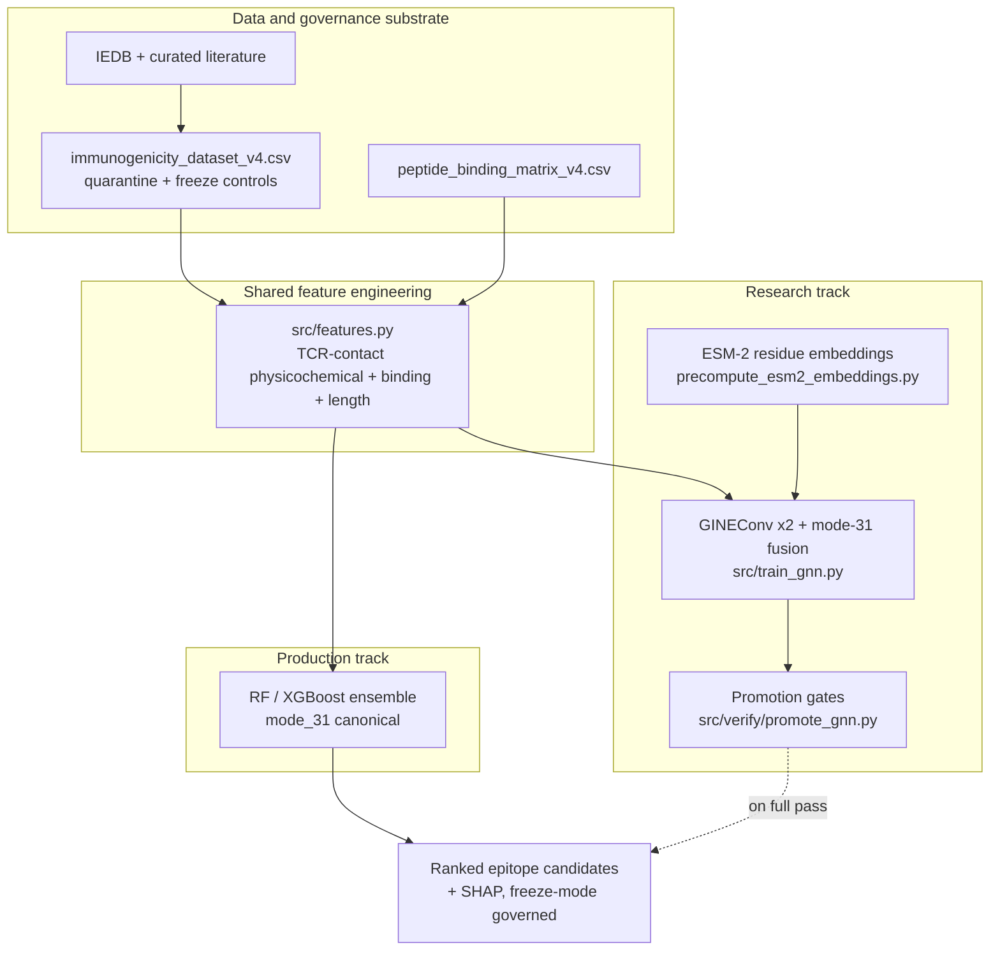
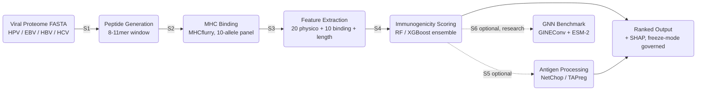

# SESTRAV Architecture

**Structural Epitope Scoring via TCR Recognition And Vaccinology**

This document is the authoritative reference for the current (v2.0) architecture of
SESTRAV: the end-to-end data flow, the two model tracks, the feature representation,
the data-governance layer, and the reproducibility and security posture. It is written
for bioinformatics and computational-immunology reviewers who want to evaluate, run, or
extend the pipeline.

> This document supersedes the earlier course-era design note in
> `docs/architecture/SESTRAV_Framework_and_Architecture.md`, which is retained only for
> historical reference.

---

## 1. Scope and design goals

SESTRAV is a **dry-lab (purely computational) pipeline** for prioritizing viral CD8+
T-cell epitopes by predicted immunogenicity, with a primary focus on HPV and EBV and
trained coverage across additional viruses. It does not perform, simulate, or claim
wet-lab efficacy; every metric in this repository is a computational evaluation against
labeled or held-out data.

The design addresses one specific gap. Most public tools predict peptide-MHC binding,
which is a necessary but weak proxy for immunogenicity (binding affinity used directly
yields AUC near 0.60). SESTRAV adds discriminative signal from the physicochemical
structure of TCR-contact residues (positions p4-p8, following Chowell et al. 2015) on
top of multi-allele presentation, and trains on experimentally curated IEDB
immunogenicity evidence.

Three properties are treated as first-class requirements, not afterthoughts:

1. **Reproducibility.** A single Snakemake DAG, version-pinned dependencies with hashes,
   committed datasets and binding matrices, and a freeze mode for release-grade runs.
2. **Auditable data governance.** Cryptographic manifests, a quarantine mechanism for
   label conflicts, and explicit provenance back to IEDB and the curated literature.
3. **Honest model gating.** A model becomes the canonical scorer only after it clears
   published quantitative gates. The current canonical scorer is the Random Forest
   ensemble; the GNN is a research track until it clears its gates.

---

## 2. System overview

SESTRAV is organized as **two model tracks over one shared feature and data substrate**,
all driven by the same Snakemake workflow.

| Track | Model | Status | Role |
|---|---|---|---|
| Production | Random Forest / XGBoost ensemble on the 31-feature representation (`mode_31`) | Validated, maintained | Canonical immunogenicity scorer used for ranked output |
| Research | GNN: GINEConv x2 + ESM-2 residue embeddings, fused with mode-31 features | Gated (4 of 5 promotion gates pass on v4) | Forward v2.0 architecture; promoted to canonical only on clearing all gates |

Both tracks consume the same physicochemical feature pipeline and the same governed
training data, which keeps comparisons fair and lets the GNN reuse the production
feature engineering rather than relearning it.

---

## 3. Pipeline stages

SESTRAV proceeds through six computational stages under a reproducible Snakemake DAG
(`pipeline.smk`, driven by `config.yaml`). Stages 5 and 6 are optional.

| Stage | Input | Process | Output |
|---|---|---|---|
| 1. Peptide generation | Viral proteome FASTA | Sliding-window 8-11mer extraction | `{proteome}_peptides.csv` |
| 2. MHC binding | Peptides + allele panel | MHCflurry 2.2.1 presentation scores, 10 HLA alleles (pinned, CI-gated) | `{proteome}_binding.csv` |
| 3. Feature extraction | Binding CSV | `src/features.py`: 20 physicochemical properties at p4-p8 + 10 per-allele binding + peptide length | `{proteome}_features.csv` |
| 4. Immunogenicity scoring | Features + serialized model | RF / XGBoost ensemble; SHAP attribution; conformal intervals | `{proteome}_ranked.csv` |
| 5. Antigen processing (optional) | Peptides | NetChop 3.1 cleavage + TAPreg transport scores joined as features (`mode_33`) | extended feature cache |
| 6. GNN benchmark (optional, research) | Peptide graphs + ESM-2 cache | GINEConv + ESM-2 scoring, fused with mode-31 features | GNN OOF predictions, eval JSON |

Binding prediction is modular: MHCflurry is the primary, pip-installable backend; a
NetMHCpan backend can be swapped into the same Stage 2 rule once an academic license is
available, feeding identical downstream stages.

**Scope note on TCR positions.** Contact positions p4-p8 follow Chowell et al. (2015) as
a length-agnostic approximation. For 8-mers, p7/p8 are zero-imputed to reflect the
compressed binding register; non-canonical registers carry additional uncertainty. This
is recorded as a disclosed limitation, not a silent default.

---

## 4. Feature representation

All features are computed by `src/features.py` and locked in `docs/feature_glossary.md`.
At each TCR-contact position SESTRAV computes a fixed set of physicochemical scales
(Kyte-Doolittle hydrophobicity, aromaticity, van der Waals volume, charge at pH 7,
Vihinen flexibility, Zimmerman bulkiness, Hopp-Woods hydrophilicity, and a TCR-upward
heuristic). These are concatenated with per-allele MHCflurry presentation scores and the
peptide length, which acts as a critical mediating variable.

| Track | Features | Composition | Role |
|---|---|---|---|
| Canonical (`mode_31`) | 31 | 20 physicochemical (p4-p8) + 10 binding + length | Default production track |
| Extended (`mode_33`) | 33 | 31 + NetChop + TAPreg antigen processing | Antigen-processing tier |
| Legacy (`mode_30`) | 30 | 20 physicochemical + 10 binding (no length) | Historical comparator |
| Legacy (`mode_21`) | 21 | Sequence-only physicochemical (binding excluded) | Historical comparator |
| Expanded (`mode_50`) | 50 | 40 physicochemical + 10 binding | Extended evaluation |
| Allele-aware (166) | 166 | Canonical + 136 HLA pocket pseudo-sequence features | Pan-allele modeling |

**Class-imbalance and bias handling.** IEDB-derived data is taxonomically and length
skewed (EBV and 9-mers dominate). `compute_sample_weights()` up-weights minority taxa and
non-9-mer lengths during training to prevent the model from over-indexing on EBV anchor
motifs. SMOTE is explicitly disallowed (it degrades AUC empirically); imbalance is handled
by sample weights for the tree ensembles and by inverse-frequency `pos_weight` with
`BCEWithLogitsLoss` for the neural tracks.

---

## 5. Production track: ensemble scorer

The canonical scorer is a Random Forest / XGBoost ensemble over the 31-feature
representation. It is trained offline by `src/train_classifier.py` with 5-fold stratified
cross-validation and out-of-fold (OOF) prediction, and the serialized model is loaded by
the scoring stage so the pipeline does not retrain at runtime.

Evaluation uses two complementary paradigms, both reported in the README and paper:

- **Tier A labeled benchmark** (head-to-head against the field): canonical `full_31`
  AUC-PR 0.828 (OOF); `full_33` 0.840, leading the compared tools.
- **Hard-decoy generalization set** (v4, 14,699 peptides, central-tolerance self-binder
  negatives): canonical `mode_31` AUC-PR 0.7635 (5-fold OOF). This number is lower by
  design because the hard decoys remove the binding-equals-immunogenic shortcut; it is
  the model shipped for production scoring.

Interpretability is built in: SHAP attribution (roughly 60% MHC binding, 40% TCR-contact
features) is committed alongside the model, confirming that the physicochemical features
carry independent signal beyond binding.

> Numbers in this document intentionally track the committed v4 results that the paper
> and `docs/claims_register.md` cite. A v5 dataset rebuild and its number reconciliation
> are sequenced as separate, gated milestones and are not yet reflected here.

---

## 6. Research track: graph neural network

The GNN is the v2.0 forward architecture. Two implementations exist in `src/gnn/`.

### 6.1 v1 (legacy, retained for tests and backward compatibility)

`GraphEncoder` / `GraphPredictor` in `src/gnn/models.py`. A hand-rolled `GCNLayer`
applies `adj @ (x @ W) + b` over a dense adjacency matrix; node features are 20-dim
one-hot amino acids in `(batch, max_len=11, 20)` shape; two GCN blocks (20 -> 32 -> 64)
are followed by global mean pooling and fused with a physicochemical dense block. The
graph builder also supports an optional spatial adjacency
(`build_spatial_adj`) that reads pre-computed pairwise distance matrices when a structural
cache is present, falling back to the chain graph otherwise.

### 6.2 v2.3 (production-candidate research track)

`GraphEncoderV2` / `GraphPredictorV2` in `src/gnn/models.py`, trained by
`src/train_gnn.py`. This is the architecture under active evaluation:

- **Node features:** pre-computed ESM-2 per-residue embeddings (canonical
  `facebook/esm2_t12_35M_UR50D`, 480-dim), produced by
  `scripts/precompute_esm2_embeddings.py` and cached. ESM-2 is never run per batch.
- **Graph topology:** a per-residue chain graph. Inputs are PyG `Data`/`Batch` objects
  with `x` (flat node embeddings), `edge_index` (batch-offset chain edges),
  `edge_attr` (one-hot self-loop / forward / backward), and `physico` (the mode-31
  features). Graphs are variable-length: only real residues become nodes, so
  `total_nodes = sum(len(seq))` across a batch, not `batch_size * max_len`.
- **Encoder:** GINEConv x2 (MessagePassing) with explicit Xavier initialization, followed
  by mean or attentional aggregation over residue nodes.
- **Fusion:** the graph embedding is concatenated with the encoded mode-31 features and
  passed through an MLP head to a single immunogenicity logit.

On v4 data the v2.3 GNN reaches mean-fold AUC-PR 0.7281, below the production RF. It is
therefore a research track, not the canonical scorer.

### 6.3 Promotion gates

`src/verify/promote_gnn.py` enforces five gates before a GNN may mutate `config.yaml` and
the checksum manifest to become canonical:

| Gate | Criterion | v4 status |
|---|---|---|
| 1. Discrimination | 5-fold AUC-PR >= 0.85 | Not met (0.7281) |
| 2. Stability | Cross-fold standard deviation <= 0.02 | Pass |
| 3. Latency | Inference latency <= 2x the RF baseline | Pass |
| 4. Calibration | Expected calibration error < 0.05 | Pass |
| 5. Escape sensitivity | Escape-variant sensitivity >= 80% | Pass |

Four of five gates pass; Gate 1 is the open blocker. The roadmap to clear it centers on a
larger multi-virus training set and an ESM-2 capacity scaling curve (t6 -> t12 -> t33).

### 6.4 Structural edges (in development, not active)

The "structural" ambition of the project is to feed 3D peptide-HLA contact geometry into
the graph. In v2.3 this is **not yet active**: the production-candidate GNN uses chain
topology plus ESM-2 representations, not 3D coordinates. A spatial-graph builder for the
PyG path and a PANDORA-derived distance cache are planned work, and SASA/torsion scalar
features (RF modes 37/39) are a parallel, independent extension. These are documented as
forward work rather than shipped capability.

---

## 7. Data architecture and governance

- **Training data:** `data/immunogenicity_dataset_v4.csv` (14,699 rows), derived from
  curated IEDB-linked immunogenicity evidence plus hard, self-proteome central-tolerance
  decoy negatives. Provenance is documented in `docs/data_registry.md`.
- **Binding matrix:** `models/peptide_binding_matrix_v4.csv` provides per-allele MHCflurry
  scores for the 10-allele panel.
- **Quarantine mechanism:** rows with intra-supertype label conflicts that the
  population-average binding features cannot resolve are flagged `is_quarantined` and
  excluded from training by `_filter_quarantined()` (applied in both the RF and GNN
  trainers). This keeps known label noise out of the learned model while preserving an
  audit trail.
- **Freeze mode:** setting `freeze_mode: true` in `config.yaml` enforces release-grade
  guardrails: no prototype-fallback scoring, no mixed legacy/canonical output stems, and
  atomic artifact updates.
- **Integrity:** `src/release_bundle.py` emits SHA-256 manifests for release archives so a
  consumer can verify exactly which data, code, and models produced a result.

A fresh clone ships with the data, proteomes, binding matrix, code, and tests, but not the
trained model binaries or runtime caches; training must run before production scoring.

---

## 8. Reproducibility and infrastructure

- **Orchestration:** Snakemake (`pipeline.smk`) expands over antigens so each proteome
  flows through an identical DAG; `config.yaml` is the single source of run parameters
  (antigen list, alleles, k-mer lengths, freeze mode).
- **Environments:** Conda (`environment.yml`), pip with hash-pinned lockfiles
  (`requirements.txt` via `pip-compile --require-hashes`), and `pyproject.toml` for the
  package. Optional extras: `sestrav[gnn]`, `sestrav[pipeline]`, `sestrav[dev]`.
- **Containers:** `Dockerfile` and `singularity.def` give identical environments on
  laptops and HPC; the pipeline is HPC-agnostic once containerized. A two-service Docker
  Compose stack serves a FastAPI scoring endpoint and a Streamlit demo, both bound to
  loopback only.
- **CI:** GitHub Actions runs the pytest suite, validates Snakemake wiring, enforces a
  dataset-curation QC gate, and runs the security workflows on every push and PR to
  `main`. Coverage is gated on two scopes (library and whole-repo).

---

## 9. Security and OpenSSF posture

SESTRAV is built to a biomedical-pipeline security standard and carries the OpenSSF Best
Practices **Passing** badge ([project 13191](https://www.bestpractices.dev/projects/13191)).

- **SAST:** Bandit, CodeQL, and Semgrep run in CI on every change.
- **Dynamic analysis:** Hypothesis property-based fuzzing exercises peptide-length and
  amino-acid edge cases in CI.
- **Supply chain:** dependencies are pinned with SHA-256 hashes; a dependency-review
  workflow blocks vulnerable imports on PRs.
- **Privacy by design:** the pipeline runs entirely offline; it does not collect, log, or
  transmit sequences, queries, or outputs. Network services bind to `127.0.0.1` only.

**Tier roadmap.** Silver is substantially met (governance, two-scope coverage gating,
Sigstore-signed releases, published threat model); the open Silver gap is the multi-person
criteria (`bus_factor`, `two_person_review`, `contributors_unassociated`) that require a
second maintainer. Gold coverage thresholds are already cleared on the library scope
(>= 90% statement, >= 80% branch); the open Gold gaps are the same multi-person criteria
plus per-file SPDX/copyright headers (`license_per_file`), deferred until a second
contributor lands. Progress is tracked in `ROADMAP.md`; full criteria mapping is in
`docs/openssf_best_practices_readiness.md`.

---

## 10. Repository map

| Path | Contents |
|---|---|
| `pipeline.smk`, `config.yaml` | Snakemake workflow and run configuration |
| `functions/` | Stage 1 (peptide generation) and Stage 2 (binding prediction) |
| `src/features.py` | TCR-contact physicochemical feature extraction and sample weighting |
| `src/train_classifier.py` | RF / XGBoost training, OOF evaluation, quarantine filtering |
| `src/gnn/` | GNN graph builder (`graph_builder.py`) and models (`models.py`) |
| `src/train_gnn.py` | GNN training (v1 dense-adjacency and v2.3 GINEConv paths) |
| `src/verify/promote_gnn.py` | Five-gate GNN promotion check |
| `src/antigen_processing.py` | NetChop / TAPreg antigen-processing features (mode 33) |
| `src/evaluate_metrics.py` | AUC-PR, AUC-ROC, ISSR/precision/recall/NDCG at top-k |
| `src/shap_analysis.py`, `src/statistical_bootstrap.py` | Interpretability and CI estimation |
| `src/release_bundle.py` | SHA-256 release manifests |
| `scripts/precompute_esm2_embeddings.py` | ESM-2 embedding cache builder for the GNN |
| `data/`, `models/`, `results/` | Committed datasets, binding matrices, and validation snapshots |

---

## 11. Related documents

- `README.md` - user-facing overview, benchmarks, and quick start.
- `docs/feature_glossary.md` - feature definitions and track schemas.
- `docs/claims_register.md` - claim-by-claim evidence and scope boundaries.
- `docs/limitations_statement_v1.md` - standardized limitation language.
- `docs/openssf_best_practices_readiness.md` - OpenSSF criteria-to-evidence mapping.
- `docs/threat_model.md`, `GOVERNANCE.md` - security assurance and governance.
- `ROADMAP.md` - 12-month direction, including the OpenSSF tier roadmap.
