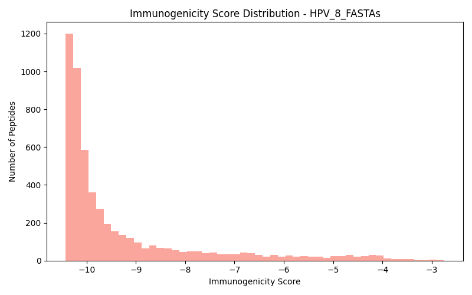
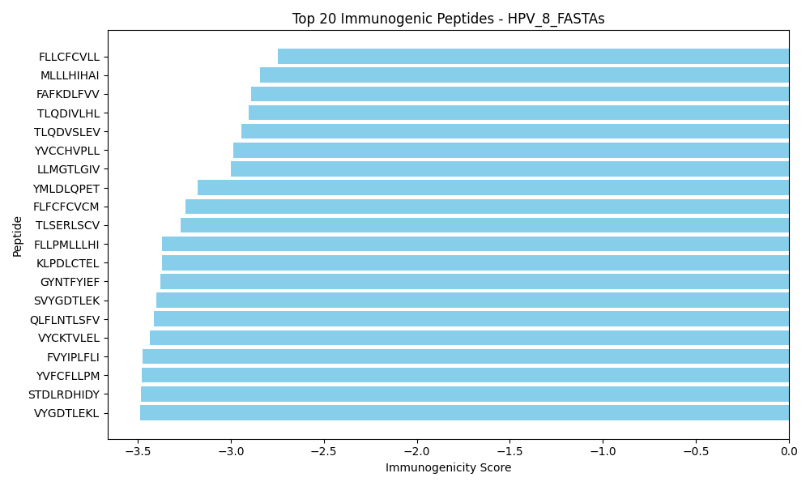

# SESTRAV Pipeline Documentation

This repository contains a **modular, reproducible data processing pipeline** built using **Snakemake**.  
The pipeline is designed to clearly separate **logic**, **execution**, and **orchestration**, enabling scalable, maintainable, and reproducible workflows.

A visualization of the pipeline structure and dependencies is available in `dag.svg`, which is automatically generated from the Snakemake workflow.

<p align="center">
  
</p>

---

## Table of Contents

- Project Overview
- Directory Structure
- Configuration
- Environment Setup
  - Conda Environment (Recommended)
  - Python Virtual Environment (venv)
- Running the Pipeline
- Sample of output

---

## Project Overview

This project implements a **Snakemake-driven pipeline** where:

- Each **pipeline stage** is implemented as a Python function
- Each stage is executed through a **script wrapper**
- **Snakemake** controls execution order, dependencies, and reproducibility
- All configuration and parameters are centralized in `config.yaml`

This design provides:
- Reproducible results
- Clear dependency tracking
- Modular and testable code
- Easy extensibility

---

## Directory Structure

```text
.
├── .snakemake/          # Snakemake internal metadata (auto-generated)
├── data/                # Input and intermediate data
├── functions/           # Core pipeline logic (Python functions)
├── results/             # Final and intermediate outputs
├── scripts/             # Script wrappers calling pipeline functions
├── config.yaml          # Central pipeline configuration file
├── environment.yml      # Conda environment specification
├── pipeline.py          # Optional Python pipeline entry point
├── pipeline.smk         # Main Snakemake workflow definition
├── README.md            # Documentation
└── requirements.txt     # Python dependencies for venv setup
```
---

## Configuration

### `config.yaml`
acts as the central control point for the pipeline.
It defines:

- Input and output paths
- Parameters and thresholds
- Runtime and execution options

``` text
antigens:
  - HPV_8_FASTAs
  - EBV_8_FASTAs

alleles:
  - HLA-A*02:01
  - HLA-A*01:01
  - HLA-B*07:02
  - HLA-B*08:01
  - HLA-A*03:01
  - HLA-A*24:02
```

All pipeline behavior should be controlled through this file rather than hardcoded values.

### `pipeline.smk`
Primary Snakemake workflow file
Defines:

- Rules
- Input/output dependencies
- Script execution
- Pipeline order

Each rule typically maps to one script in the scripts/ directory.

``` text
configfile: "config.yaml"

ANTIGENS = config["antigens"]

rule Results:
    input:
        expand("results/{virus}_ranked.csv", virus=ANTIGENS),
        expand("results/{virus}_top20_immunogenicity.png", virus=ANTIGENS)


rule generate_peptides:
    input:
        "data/proteomes/{virus}.fasta"
    output:
        "results/{virus}_peptides.csv"
    script:
        "scripts/stage1.py"


rule predict_binding:
    input:
        "results/{virus}_peptides.csv"
    output:
        "results/{virus}_binding.csv"
    script:
        "scripts/stage2.py"


rule extract_features:
    input:
        "results/{virus}_binding.csv"
    output:
        "results/{virus}_features.csv"
    script:
        "scripts/stage3.py"


rule score_immunogenicity:
    input:
        "results/{virus}_features.csv"
    output:
        "results/{virus}_ranked.csv",
        "results/{virus}_top20_immunogenicity.png"
    script:
        "scripts/stage4.py"
```

---

## Environment Setup
The pipeline supports two execution environments:

- Conda (recommended for reproducibility)
- Python virtual environment (venv)

### Conda Environment
#### Create conda env
``` bash
conda env create -f environment
```

#### Activate the env
``` bash
conda activate sestrav
```

#### Verify installation
``` bash
snakemake --version
python --version
```


### Python virtual environment
``` bash
python -m venv .venv
source .venv/bin/activate
pip install -r requirements.txt
```


## Run the pipeline
``` bash
snakemake --cores 1
```

for parallel execution use `--cores > 1`
``` bash
snakemake --cores 4
```

## Sample Output

The following figures are sample of output for HPV_8, the remaining results are csv files in `results/plots folder`.

**Score distribution**
<p align="center">
  
</p>

**Top20 immunogenicity**
<p align="center">
  
</p>