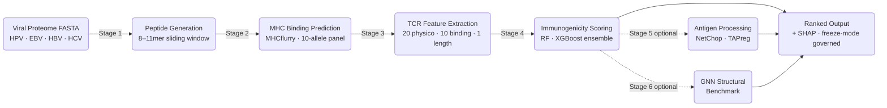

# SESTRAV: Structural Epitope Scoring via TCR Recognition And Vaccinology


[](https://www.bestpractices.dev/projects/13191)

## SESTRAV vs Field

| Capability | SESTRAV | PredIG | PRIME | NetMHCpan | pVACtools |
|---|---|---|---|---|---|
| End-to-end workflow (proteome → ranked output) | ✓ | Partial | Partial | ✗ | ✓ (neoantigens) |
| Open source, pip-installable | ✓ | ✓ | ✓ | Academic license | ✓ |
| Cryptographic dataset governance (freeze mode) | ✓ | ✗ | ✗ | ✗ | ✗ |
| OpenSSF Passing badge | ✓ | ✗ | ✗ | ✗ | ✗ |
| Antigen processing as training features | `feature_mode=33` | ✓ | Partial | ✗ | Partial |
| Graph Neural Network scorer | ✓ (v2.3 GINEConv+ESM-2; research/ensemble component) | ✗ | ✗ | ✗ | ✗ |
| Pan-allele training | v4 schema ready | Partial | ✓ | ✓ | ✓ |
| Multi-virus support | 12 viruses trained · 4 curated scanning panels (HPV · EBV · HBV · HCV) | Limited | Limited | Pan-pathogen | Tumor |
| Wet-lab candidate protocol included | ✓ | ✗ | ✗ | ✗ | Partial |
| AUC-PR on labeled benchmark (Tier A) | **0.840 (OOF, `full_33`)** · 0.828 (`full_31`) | 0.727 | 0.777 | N/A | N/A |

*Tier A 704-peptide labeled benchmark. SESTRAV RF evaluated out-of-fold (conservative); external tools fully-trained on a test set with 36.9% confirmed training overlap (optimistic). The closest external tool is BigMHC (0.822); full field (incl. MixMHCpred, DeepImmuno) in External Benchmark Results below. Separately, on the harder v4 hard-decoy generalization set (14,699 peptides), canonical `mode_31` scores AUC-PR 0.7635 - lower by design (see below). `full_33` is the best Tier A result; `full_31`/`mode_31` is the canonical track. Methodology: `docs/external_testing/External_Validation_Sign_Off.md`.*

---

Predicting whether a viral peptide will elicit a CD8⁺ T-cell response is harder than predicting MHC binding. Binding-only approaches achieve AUC-PR ≈ 0.80 on the SESTRAV benchmark - yet most public tools stop there. SESTRAV bridges this gap by extracting physicochemical features from TCR-contact residues (positions p4–p8, following Chowell et al. 2015) and training ensemble classifiers on experimentally validated IEDB immunogenicity data.

> SESTRAV is a governed computational workflow for viral T-cell epitope prioritization (immunogenicity scoring against a self-proteome background). It integrates six computational stages - proteome-scale peptide generation, multi-allele MHC binding prediction, TCR contact physicochemical feature extraction, antigen processing scoring, ensemble immunogenicity inference, and freeze-mode governed output - under a single reproducible Snakemake DAG with cryptographic dataset provenance. To our knowledge, no publicly available tool integrates antigen processing, physicochemical TCR features, and graph neural network scoring within an OpenSSF-compliant, auditable pipeline.

The canonical release uses a 31-feature model (20 physicochemical properties at TCR-contact positions + 10 per-allele MHC binding scores + peptide length as the critical mediating variable). On the Tier A labeled benchmark it achieves AUC-PR 0.828 (weighted OOF; 0.864 unweighted ablation); on the harder v4 hard-decoy generalization set it achieves 0.7635 (see External Benchmark Results). Leave-one-virus-out analysis shows the model generalizes as viral-vs-self epitope prioritization (its intended use; AUC-ROC 0.99 separating viral epitopes from self-peptides); within-virus ranking of immunogenic vs non-immunogenic peptides is limited and reported transparently. Optional tiers add antigen processing features (NetChop/TAPreg, `feature_mode=33`) and a GINEConv+ESM-2 graph neural network research track.

## Background and Motivation

Most computational pipelines focus on MHC presentation, predicting whether a peptide is displayed on the cell surface. However, binding affinity alone is a weak proxy for immunogenicity (typical AUC ≈ 0.60 when used directly; Carri et al., 2023). SESTRAV addresses this limitation by extracting features from TCR-contact residues (primarily positions p4–p8) and training classifiers on experimentally validated immunogenicity data from the IEDB.

This approach combines structural insights with multi-allele binding predictions to better discriminate true immunogenic epitopes.

## Release Tracks and Policy

* **Canonical track (default):** 31-feature configuration (20 physicochemical + 10 multi-allele MHC binding + peptide length). Tier A AUC-PR 0.828 (weighted OOF) / v4 hard-decoy 0.7635. This is the maintained release path and the production scorer.
* **Extended track:** 33-feature configuration adds NetChop 3.1 and TAPreg antigen processing scores as training features (`feature_mode=33`). AUC-PR 0.886 (unweighted) / 0.840 (weighted) - best v3 result; +0.022 over canonical. Requires antigen processing cache; see `scripts/precompute_antigen_processing.py`.
* **Legacy comparator track:** 30-feature (without peptide length) and 21-feature (sequence-only) configurations retained for historical reproducibility.

**Source of Truth:** SESTRAV v2 designates this repository (main branch) as the single authoritative source. For release-grade reproducibility, enable `freeze_mode: true` in `config.yaml`. Freeze mode enforces strict guardrails: no Stage 4 prototype fallback, no mixed legacy/canonical output stems, and atomic artifact updates.

## Security & Compliance Posture

SESTRAV 2.0 maintains a rigorous security posture suitable for biomedical data pipelines.
*   **SAST & CI:** All commits are gated by Bandit, CodeQL, and Semgrep via GitHub Actions.
*   **Dependency Pinning:** Environment files use strict `--require-hashes` to mitigate supply-chain attacks.
*   **Data Integrity:** The pipeline uses `freeze_mode` constraints to guarantee data immutability during reproducibility benchmarking.

For vulnerability reporting, refer to `SECURITY.md`. For a detailed compliance matrix against OpenSSF standards, see `docs/security_compliance.md`.

## Validation Status

The committed release evidence (v3 dataset, 1004 peptides, 3.35:1 class ratio) provides the following computational validation:

| Metric / Check | Result |
| :--- | :--- |
| H2 Tier A decision (R10 ≥ 2.0) | **Not supported** (R10 = 0.9494) |
| Gold-standard positive recovery | 15/15 positives found; 7/15 in top 25% |
| Binding-only baseline comparison | Baseline recovers 15/15 (expected for strong-binder set) |
| Gold-standard negative discrimination | 9/10 negatives pushed down vs. binding-only |
| SHAP feature contribution | ~60% MHC binding, ~40% TCR-contact features |

**Important:** These results constitute computational validation only and do not establish biological efficacy. Wet-lab experimental confirmation is required for any therapeutic claims. See `results/final_validation_report.md` and `docs/limitations_statement_v1.md` for full details.

## External Benchmark Results

SESTRAV is evaluated under **two complementary paradigms**: (1) a **Tier A labeled benchmark** for a clean head-to-head against the field, and (2) a **larger, harder hard-decoy generalization set** that decouples MHC binding from immunogenicity. The two numbers are not competing - the v4 figure is lower *by design* because the task is harder.

### Paradigm 1 - Tier A head-to-head (N=720 labeled; SESTRAV OOF on the N=704 scored intersection)

| Tool | AUC-PR | ISSR@10 | Evaluation |
|------|--------|---------|------------|
| **SESTRAV RF (`full_33`)** | **0.840** | 0.916 | OOF 5-fold (conservative) |
| SESTRAV RF (`full_31`, canonical) | 0.828 | 0.843 | OOF 5-fold |
| BigMHC | 0.822 | **0.917** | Fully trained |
| MixMHCpred 2.2 | 0.795 | 0.847 | Fully scored |
| Binding-only (MHCflurry) | 0.800 | 0.861 | Fully scored |
| PRIME 2.1 | 0.777 | 0.871 | Fully trained |
| PredIG-Path | 0.727 | 0.786 | Fully trained |
| DeepImmuno | 0.698 | 0.710 | Fully trained (9/10-mer only, n=623) |

> **Read this honestly:** BigMHC (0.822) is a near-tie with SESTRAV's canonical `full_31` (0.828) and edges it on top-decile recall - but SESTRAV is scored strictly out-of-fold while BigMHC is fully trained on undisclosed data. SESTRAV's `full_33` (0.840) leads the field. Source: `results/table3_tier_a_metrics.csv`; full methodology in paper §3.3.

### Paradigm 2 - v4 hard-decoy generalization (N=14,699; 12 viruses + central-tolerance decoys)

| Model | AUC-PR | Notes |
|------|--------|-------|
| **SESTRAV RF (`mode_31`, canonical)** | **0.7635 ± 0.009** | 5-fold OOF; production scorer |

> The hard decoys are self-proteome MHC binders (label 0) that remove the "binding → immunogenic" shortcut present in conventional negative sets. The lower AUC-PR vs. Tier A reflects this harder, more realistic task - not a regression. This is the model shipped for production scoring.

> **Primary metric:** AUC-PR (class-imbalanced data; random baseline ≈ positive prevalence). ISSR@10 = fraction of true positives ranked in the top 10%.

### Benchmark Overlap and Clean-Holdout Comparison

Because SESTRAV and the comparator tools all draw on IEDB-derived data, a systematic overlap analysis was run to keep the comparison fair. Using exact + substring matching against an IEDB-proxy peptide reference, an estimated **36.9% of the evaluation set overlaps that proxy reference** - i.e. peptides that any IEDB-trained model could plausibly have seen during training. To remove this ambiguity, results are also reported on the overlap-excluded clean holdout:

| Tool | AUC-PR (clean holdout, N=451) | Δ vs. intersection set |
|------|-------------------------------|------------------------|
| **RF (SESTRAV 2.0)** | **0.822** | −0.006 |
| PRIME 2.1 | 0.720 | −0.057 |

The clean holdout is the appropriate rigorous comparator: it removes evaluation peptides that any IEDB-trained tool could have encountered during training, so the comparison does not hinge on the unknown composition of external tools' training sets. Overlap is estimated against an IEDB-proxy reference (the authoritative training sets for the external tools are not publicly released), so these figures should be read as approximate and not as a claim about any specific tool's training data.

### SHAP Feature Attribution

SHAP analysis (Random Forest, 720 samples) attributes the decision to:
- **60%** MHC binding features (per-allele presentation scores)
- **40%** TCR-contact physicochemical features (positions p4–p8)

This 60/40 split confirms that TCR features provide meaningful independent signal beyond binding alone, consistent with the 9/10 gold-standard negative discrimination result.

See [`results/external_benchmark_comparison.md`](results/external_benchmark_comparison.md) for full methodology and [`results/shap_values_rf.csv`](results/shap_values_rf.csv) for per-feature SHAP values.

## Pipeline Overview

SESTRAV proceeds through six computational stages under a reproducible Snakemake DAG:


```mermaid
graph LR
    A("Viral Proteome FASTA<br/>HPV · EBV · HBV · HCV") -->|Stage 1| B("Peptide Generation<br/>8–11mer sliding window")
    B -->|Stage 2| C("MHC Binding Prediction<br/>MHCflurry · 10-allele panel")
    C -->|Stage 3| D("TCR Feature Extraction<br/>20 physico · 10 binding · 1 length")
    D -->|Stage 4| E("Immunogenicity Scoring<br/>RF · XGBoost ensemble")
    E -.->|Stage 5 optional| F("Antigen Processing<br/>NetChop · TAPreg")
    E -.->|Stage 6 optional| G("GNN Structural<br/>Benchmark")
    E --> H("Ranked Output<br/>+ SHAP · freeze-mode governed")
    F --> H
    G --> H
```

1. **Peptide Generation:** Sliding-window extraction of 8–11mer peptides from viral proteome FASTA files.
2. **MHC Binding Prediction:** MHCflurry 2.2.1 presentation scores across 10 common HLA alleles (pinned version, CI-gated).
3. **TCR Feature Extraction:** 20 physicochemical properties at TCR-contact positions p4–p8 + 10 binding scores + peptide length = 31 features (canonical) or 33 with antigen processing tier.
4. **Immunogenicity Scoring:** Ensemble classification (RF, XGBoost) with SHAP interpretability and conformal prediction intervals.
5. **Antigen Processing** *(optional, `feature_mode=33`)*: NetChop 3.1 proteasomal cleavage + TAPreg TAP transport scores as additional training features.
6. **GNN Structural Benchmark** *(optional)*: Graph neural network scoring on peptide backbone graphs; Gates 2+3 pass on v3 data.

**Input:** Viral proteome FASTA files (default: HPV16/18, EBV B95-8, HBV ayw, HCV 1a panels).
**Output:** Ranked epitope candidates with immunogenicity scores, SHAP values, and visualizations.

> **Scope note:** TCR contact positions p4–p8 follow Chowell et al. (2015), applied as a length-agnostic approximation. For 8-mer peptides, p7/p8 are zero-imputed to reflect the compressed binding register; predictions for non-canonical binding registers carry additional uncertainty.

## Input Data and Naming Conventions

SESTRAV runs on bundled repository data by default. User-uploaded files are unnecessary unless intentionally overriding defaults.

### Proteome Identifiers

| Proteome ID | Virus | Strain(s) | Antigens | FASTA File |
| :--- | :--- | :--- | :--- | :--- |
| `HPV16_18_panel8` | Human Papillomavirus | HPV-16, HPV-18 | 8 (E2, E5, E6, E7 from each strain) | `data/proteomes/HPV16_18_panel8.fasta` |
| `EBV_B95_8_panel8` | Epstein-Barr Virus | B95-8 | 8 (EBNA1, EBNA3A, EBNA3B, LMP1, LMP2A, gp350, BZLF1, BRLF1) | `data/proteomes/EBV_B95_8_panel8.fasta` |
| `HBV_ayw_panel4` | Hepatitis B Virus | genotype D/ayw | 4 (HBcAg, HBx, HBsAg-S, HBpol) | `data/proteomes/HBV_ayw_panel4.fasta` |
| `HCV_1a_panel4` | Hepatitis C Virus | genotype 1a/1b | 4 (Core, NS3, NS5A, NS5B) | `data/proteomes/HCV_1a_panel4.fasta` |

*Full UniProt accessions are available in `docs/antigen_accessions.md`.*

### Output File Naming

Per-proteome outputs follow the pattern `results/{proteome_id}_{suffix}`:

| Suffix | Contents |
| :--- | :--- |
| `_peptides.csv` | All 8-11mer peptides (Stage 1) |
| `_binding.csv` | MHCflurry presentation scores (Stage 2) |
| `_features.csv` | 31 features per peptide (Stage 3, canonical) |
| `_ranked.csv` | Final scored and ranked epitope candidates (Stage 4) |
| `_top20_immunogenicity.png` | Bar chart of top 20 predicted immunogenic peptides |
| `_score_distribution.png` | Histogram of score distribution across all peptides |

Validation and analysis outputs (committed) are summarized in `results/`; see the repository for the complete list.

## Feature Schemas

At each TCR contact position, SESTRAV computes the following physicochemical properties. Unless otherwise referenced, properties are based on canonical amino acid physicochemical classifications.

| Property | Scale / Definition | Source |
| :--- | :--- | :--- |
| Hydrophobicity | Kyte-Doolittle (-4.5 to +4.5) | Kyte & Doolittle, 1982 |
| Aromaticity | Binary (F, W, Y, H = 1) | Canonical |
| Van der Waals volume | ų | Zamyatnin, 1972 |
| Charge at pH 7 | K/R = +1, D/E = -1, others = 0 | Canonical |
| Flexibility | Vihinen flexibility (0.904 - 1.102) | Vihinen et al., 1994 |
| Bulkiness | Zimmerman bulkiness (3.4 - 21.67) | Zimmerman et al., 1968 |
| Hydrophilicity | Hopp-Woods (-3.4 to 3.0) | Hopp & Woods, 1981 |
| TCR upward probability | Heuristic derived from structural alignments | Internal structural mapping |

### Track Definitions

| Track | Features | AUC-PR (v3 OOF) | Use Case |
| :--- | :--- | :--- | :--- |
| Canonical (31-feature) | 20 physicochemical + 10 binding + length | 0.864 | Default release track |
| Extended (33-feature) | 31 + NetChop + TAPreg | 0.886 (unweighted) / 0.840 (weighted) | Antigen processing tier - best v3 result |
| Legacy (30-feature) | 20 physicochemical + 10 binding | 0.825 | Historical comparator |
| Legacy (21-feature) | Sequence-only (binding excluded) | 0.772 | Historical comparator |
| Expanded (50-feature) | 40 physicochemical + 10 binding | - | Extended evaluation |
| Allele-aware (166) | Canonical + 136 HLA pocket pseudo-sequences | - | Pan-allele modeling |

Stage 4 auto-detects the appropriate feature set for each trained model.

## Biological Data Limitations & Mitigation

The input training data for SESTRAV contains severe biological biases inherent to public datasets (like IEDB). A quantitative breakdown of these taxonomic and topological skews is detailed in the data bias audit (internal document; key findings summarized below).

* **Taxonomic skew:** EBV 68.13%, HPV16 30.88%, HPV11 1.00%.
* **Length skew:** 9-mer peptides 64.74%.

To prevent machine learning models from over-indexing on EBV-specific anchor motifs and 9-mer length preferences (which would lead to poor generalization on minority taxa like HPV11 or non-canonical peptide lengths), the `compute_sample_weights()` function in [features.py](src/features.py) is **CRITICAL**. It dynamically calculates sample weights to up-weight minority taxa and non-9-mer peptides during model training, balancing the learning signal and ensuring robust pan-viral performance.

## Quick Start

### 1. Environment Setup

**Conda (recommended for reproducibility):**
```bash
conda env create -f environment.yml
conda activate sestrav
mhcflurry-downloads fetch models_class1_presentation
```

**pip (editable/dev):**
```bash
pip install -e ".[dev]"          # lint + test tools
mhcflurry-downloads fetch models_class1_presentation
```

**venv:**
```bash
python -m venv .venv
source .venv/bin/activate      # Linux/macOS
pip install -r requirements.txt
pip install snakemake
mhcflurry-downloads fetch models_class1_presentation
```

### 2. Install and Train Models

```bash
# Core install (RF/XGBoost pipeline)
pip install sestrav

# With GNN structural scorer
pip install "sestrav[gnn]"

# With Snakemake pipeline runner
pip install "sestrav[pipeline]"

# Developer install (ruff, mypy, pytest)
pip install -e ".[dev]"
```

Models must be trained before production pipeline execution:

```bash
# Canonical 31-feature track (recommended)
python -m src.train_classifier \
  --data data/immunogenicity_dataset_v4.csv \
  --feature-mode 31 \
  --binding-matrix models/peptide_binding_matrix_v4.csv \
  --sample-weights

# CLI equivalent
sestrav validate \
  --dataset data/immunogenicity_dataset_v4.csv \
  --feature-mode 31 \
  --binding-matrix models/peptide_binding_matrix_v4.csv \
  --sample-weights \
  --report results/validation_report_v4.md
```

*Note:* Without trained models, the pipeline falls back to a prototype mode using binding-derived pseudo-labels (for testing only; not scientifically valid).

### 3. Run the Pipeline

```bash
# Snakemake (recommended)
snakemake --snakefile pipeline.smk --cores 4

# Standalone entry point
python pipeline.py
```

### 4. Validate Release Readiness

```bash
git status
python -m pytest tests/test_features.py tests/test_metrics.py tests/test_pipeline_integration.py -q
snakemake --snakefile pipeline.smk --dry-run --cores 1   # optional
```

For freeze-grade validation:

```bash
snakemake --snakefile pipeline.smk full_validation_report --cores 4 --forceall
```

### 5. Post-Pipeline Analysis (Optional)

Generate full validation report:

```bash
snakemake --snakefile pipeline.smk full_validation_report --cores 4
```

Prepare inputs for external tool comparison (PredIG, PRIME):

```bash
python -m src.prepare_external_validation_inputs
python -m src.external_benchmark_comparison --predig ... --prime ...
```

See `scripts/README.md` for the external-validation utilities and workflow.

### 6. ANN / GNN Benchmarks (Optional)

* **ANN:** `pip install -r requirements-ann.txt`, then `python -m src.ann_benchmark --help`.
Default architecture: 256-128-64 ReLU, dropout 0.2 (AUC-PR = 0.8252 ± 0.0248).
* **GNN v2.1:** `pip install "sestrav[gnn]"`, then `python -m src.train_gnn --help`.
Architecture: GINEConv × 2 (GINEConv + ESM-2 320-dim node embeddings, `facebook/esm2_t6_8M_UR50D`). 4/5 promotion gates PASS on v4 data (AUC-PR 0.7241; Gate 1 ≥ 0.85 target in progress). Pre-compute ESM-2 embeddings with `scripts/precompute_esm2_embeddings.py` before training.

### 7. Google Colab

A Colab-ready script is available in `notebooks/SESTRAV_Colab_Pipeline.py`; see `notebooks/README.md` for details.

## Container Quick Start

The Docker image does **not** include trained models. Build and then train:

```bash
docker build -t sestrav:latest .
docker run --rm -v "$(pwd)/models:/app/models" sestrav:latest \
  -m src.train_classifier --data data/immunogenicity_dataset_v4.csv \
  --feature-mode 31 --binding-matrix models/peptide_binding_matrix_v4.csv
```

Run the pipeline with bind-mounted directories:

```bash
mkdir -p results
docker run --rm \
  -v "$(pwd)/models:/app/models" \
  -v "$(pwd)/results:/app/results" \
  sestrav:latest
```

Windows PowerShell:

```powershell
New-Item -ItemType Directory -Force results | Out-Null
docker run --rm `
  -v "${PWD}/models:/app/models" `
  -v "${PWD}/results:/app/results" `
  sestrav:latest
```

Container smoke test (recommended before release):

```bash
docker run --rm -v "$(pwd)/data:/app/data:ro" sestrav:latest -m pytest tests/ -q --basetemp=tmp_pytest
```


### API & Demo Quick Start (Docker Compose)

A two-service Docker Compose stack serves the FastAPI microservice and Streamlit demo
from pre-trained model artifacts. Model binaries must be present in `models/` before
launching.

```bash
# Build and launch both services
docker compose up --build

# FastAPI docs:  http://localhost:8000/docs
# Streamlit demo: http://localhost:8501
```

Single-peptide API request:

```bash
curl -X POST "http://localhost:8000/score" \
  -H "Content-Type: application/json" \
  -d '{"sequence":"GILGFVFTL","allele":"HLA-A*02:01"}'
```

Both services bind to `127.0.0.1` only (loopback) to prevent unintended public
exposure on shared research machines.  Model artifacts are mounted read-only.


| Virus | Antigens |
|---|---|
| EBV (8) | EBNA1, EBNA3A, EBNA3B, LMP1, LMP2A, gp350, BZLF1, BRLF1 |
| HPV (8) | HPV16 E2, E5, E6, E7; HPV18 E2, E5, E6, E7 |

## Evaluation Metrics

All metrics are computed by `src/evaluate_metrics.py`.

| Metric | Description |
| --- | --- |
| AUC-PR | Area Under Precision-Recall Curve (primary metric, robust to class imbalance) |
| AUC-ROC | Area Under ROC Curve |
| ISSR@10/25 | True positive fraction in top 10% / 25% (enrichment) |
| Precision@10/25 | Precision among top 10% / 25% predictions |
| Recall@10/25 | Recall captured in top 10% / 25% |
| NDCG@10/25 | Normalized Discounted Cumulative Gain at top 10% / 25% |

## Reproducibility and Data Provenance

**Included in this repository:**

* Training dataset (`data/immunogenicity_dataset_v4.csv`, 14,699 rows - v3 also retained for historical comparison)
* Viral proteomes (`data/proteomes/`)
* Binding matrix (`models/peptide_binding_matrix_v4.csv`) and model metadata
* All pipeline code, tests, and documentation

**Generated locally (excluded from git):**

* Trained model binaries (`*.joblib`, `*.pt`)
* Most workflow outputs in `results/` (except committed validation snapshots)
* Runtime caches

A fresh clone must run model training before production scoring. Release bundles with SHA256 manifests can be created via `python -m src.release_bundle`.

Training labels are derived from curated IEDB-linked immunogenicity evidence. Publications should cite both this repository and the original upstream data sources.

## Documentation

| Document | Description |
| --- | --- |
| `docs/feature_glossary.md` | Feature definitions and track schemas |
| `docs/antigen_accessions.md` | Full UniProt accessions and gene names |
| `docs/output_naming_standard_v1.md` | Output file naming policy |
| `src/naming.py` | Legacy proteome/model ID alias compatibility |
| `docs/validation_summary.md` | Detailed validation results and interpretation |
| `docs/limitations_statement_v1.md` | Standardized external communication language |

## Cite This Work

If you use SESTRAV in your research, please cite this repository:

```bibtex
@software{borges2026sestrav,
  author    = {Borges, Gavin and Eljamal, Abdelrahman and Schellenberg, Iris and
               Jouaneh, Charles and Byers, Emine},
  title     = {{SESTRAV}: Structural Epitope Scoring via {TCR} Recognition And Vaccinology},
  year      = {2026},
  url       = {https://github.com/gavin-borges/SESTRAV},
  version   = {2.0.3}
}
```

See [`CITATION.cff`](CITATION.cff) for the full machine-readable citation.

## License

MIT License. See `LICENSE` for details.

## Maintainers and Contributors

**Lead Developer & Maintainer (SESTRAV 2.0)**

* Gavin Borges

**Original SESTRAV 1.0 Foundation Team (University of Rhode Island)**

* Abdelrahman Eljamal: ML Engineer & Computational Architect
* Iris Schellenberg: Translational Vaccine Strategy, Data Finding, and Curation
* Charles Jouaneh: Vaccine Strategy & Bioinformatic Pipeline Development
* Emine Byers: Structural Immunology & Data Curation

*Academic affiliations: BPS 542 / CMB 522 / CSC 522 / STA 522: Bioinformatics I | CMB 523: Bioinformatics II*
