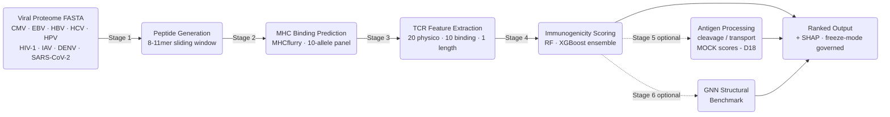

# SESTRAV: Structural Epitope Scoring via TCR Recognition And Vaccinology


[](https://www.bestpractices.dev/projects/13191)

**SESTRAV** is a dry-lab (purely computational) pipeline for prioritizing viral CD8+ T-cell epitopes by predicted immunogenicity within a given pathogen, covering nine viral pathogens each trained and validated separately (CMV, EBV, HBV, HCV, HPV, HIV-1, IAV, DENV, SARS-CoV-2). It targets the specificity bottleneck that binding-only tools leave open: MHC binding is a weak proxy for T-cell immunogenicity, so SESTRAV combines multi-allele presentation scores with the physicochemical structure of TCR-contact residues (positions p4-p8) in a single trained classifier.

The system is organized as two model tracks under a single reproducible Snakemake workflow:

- **Production track (validated):** a Random Forest / XGBoost ensemble over a 31-feature structural representation (canonical `mode_31`). This is the maintained, benchmarked scorer.
- **Research track (gated):** a graph neural network (GINEConv + ESM-2 residue embeddings) that fuses a peptide residue graph with the same physicochemical features. It is the v2.0 forward architecture and is held to explicit promotion gates before it can become canonical.

SESTRAV carries the OpenSSF Best Practices **Passing** badge (project 13191), which is the project's intended terminal tier - Silver and Gold require multi-person criteria that a solo-maintained project cannot meet (see Security and Compliance Posture). All results reported here are computational; no wet-lab efficacy is claimed. The end-to-end design is documented in [`ARCHITECTURE.md`](ARCHITECTURE.md).

### Start here

*Orientation only. Every figure lives in the sections below, and nothing is restated here, so this block cannot drift out of step with them.*

**Who it is for.** Researchers selecting CD8+ T-cell epitope candidates from a viral proteome for downstream wet-lab screening, and anyone benchmarking immunogenicity predictors who wants a governed, auditable pipeline to compare against.

**What it does.** Ranks peptides from a proteome by predicted immunogenicity **within one pathogen at a time**. It is scoped for within-virus prioritization, not cross-virus transfer - the leave-one-virus-out results below quantify exactly where that boundary is, and they are reported in full rather than summarized favourably.

**What to expect before you start.** There is **no pre-trained model in this repository** - `models/` ships no `.joblib`, deliberately, because an unlabeled checkpoint is a provenance risk this project has been bitten by twice. So the first run is a training run, not a prediction run, and it is not a five-minute exercise. [`USAGE.md`](USAGE.md) walks the path in order.

**Where to go next.**

| You want to... | Go to |
|---|---|
| Run it | [Quick Start](#quick-start), then [`USAGE.md`](USAGE.md) |
| Judge the evidence | External Benchmark Results, and [`docs/claims_register.md`](docs/claims_register.md) for the scope boundary on every certified number |
| Understand the design | [`ARCHITECTURE.md`](ARCHITECTURE.md) |
| Know the limits | [`docs/limitations_statement_v1.md`](docs/limitations_statement_v1.md), and the LOO section below |

## SESTRAV vs Field

| Capability | SESTRAV | PredIG | PRIME | NetMHCpan | pVACtools |
|---|---|---|---|---|---|
| End-to-end workflow (proteome → ranked output) | ✓ | Partial | Partial | ✗ | ✓ (neoantigens) |
| Open source, pip-installable | Open source; `pip install .` from source (not yet on PyPI - `ROADMAP.md`) | ✓ | ✓ | Academic license | ✓ |
| Cryptographic dataset governance (freeze mode) | ✓ | ✗ | ✗ | ✗ | ✗ |
| OpenSSF Passing badge | ✓ | ✗ | ✗ | ✗ | ✗ |
| Antigen processing as training features | `feature_mode=33` | ✓ | Partial | ✗ | Partial |
| Graph Neural Network scorer | ✓ (v2.3 GINEConv+ESM-2; research/ensemble component) | ✗ | ✗ | ✗ | ✗ |
| Pan-allele training | ✗ - ten fixed HLA-A/-B binding columns; allele identity is not a model feature, so the production model is allele-blind. A `feature_mode=166` allele-aware track exists but was not adopted (`ROADMAP.md`), and its pocket features are under review - see claims register D30 | Partial | ✓ | ✓ | ✓ |
| Multi-virus support | 9 viruses (v5 active), each a separately-validated within-virus panel - not cross-virus transfer, see LOO below: CMV, EBV, HBV, HCV, HPV, HIV-1, IAV, DENV, SARS-CoV-2 | Limited | Limited | Pan-pathogen | Tumor |
| Wet-lab candidate protocol included | ✓ | ✗ | ✗ | ✗ | Partial |
| AUC-PR on labeled benchmark (Tier A) | **0.828 (OOF, 30-feature, unweighted, 2026-05; not `mode_31` - see note below)** | not benchmarked | not benchmarked | N/A | N/A |

*Tier A 704-peptide labeled benchmark. SESTRAV RF is evaluated out-of-fold; external tools are fully scored on the same peptides. **That asymmetry does not favour the external tools as previously claimed here.** This Tier A arm's 720-peptide corpus has zero duplicate peptides (D16), so the exact-peptide leakage affecting the v5 figures below (D15) is a structural no-op here and does not apply. A different, unquantified risk does apply: 32.1% of the 704-peptide scored pool has a substring-level near-duplicate elsewhere in the pool, never filtered for this benchmark; whether it affected the score is not established (`docs/claims_register.md` D22). Every v5 cross-validation figure below is peptide-grouped as of 2026-08-10; this Tier A figure deliberately is not, and peptide-grouping would not address the substring-homology risk in any case (D16, D22). The certified head-to-head field is in External Benchmark Results below - BigMHC (0.822), MHCflurry binding-only (0.800), MixMHCpred 2.2 (0.795), and DeepImmuno (0.698), all bound to `results/table3_tier_a_metrics.csv`; the closest external tool is BigMHC (0.822). PredIG and PRIME are compared on capabilities only: their metric head-to-head is not reproducible from a certified results file and is not reported. pVACtools targets a different problem domain (patient-specific tumor neoantigens from somatic variant calls) rather than published viral epitopes from proteome sequence, so the "(neoantigens)"/"Tumor"/"N/A" cells in its column above are not a head-to-head with the viral-epitope rows. Separately, on the harder v5 generalization set (35,597 active rows, 9 viruses), canonical `mode_31` reports pooled **peptide-grouped** cross-validation AUC-PR **0.6058** (re-baselined 2026-08-10, closing D15; the prior ungrouped figure 0.8312 was leakage-inflated and is retracted) and same-pathogen (within-virus) discrimination per-virus (mean within-CV AUC-ROC **0.658**; prior ungrouped 0.751 retracted; the pooled AUC-ROC 0.9368 reported before that was separately decoy-inflated and is also retracted - see Paradigm 2 below). **0.828 is NOT a `full_31`/`mode_31` result** - it is a 30-feature, unweighted, 200-tree measurement from 2026-05, predating `feature_mode=31`'s introduction by 26 days (`docs/claims_register.md` D16); the extended `full_33` antigen-processing configuration is reported separately under Release Tracks and is not part of this certified field. Certified per-tool metrics and their scope boundaries: `results/table3_tier_a_metrics.csv` and `docs/claims_register.md`. (`results/external_benchmark_comparison.md` is a 2026-05-22 SESTRAV-vs-binding-only-only report carrying the same pre-D16 mislabel and an unresolved provenance gap - historical reference only, not a citable source for the 5-tool field above.)*

---

Predicting whether a viral peptide will elicit a CD8⁺ T-cell response is harder than predicting MHC binding. Most public tools stop at binding. SESTRAV trains ensemble classifiers on both multi-allele presentation scores and physicochemical features from TCR-contact residues (positions p4-p8, following Chowell et al. 2015), using experimentally validated IEDB immunogenicity data. **Reworded 2026-08-15: this passage previously said binding-only reaches AUC-PR 0.80 and that SESTRAV "bridges this gap" with physicochemical features.** That paired a directional claim with a number supporting the opposite direction. The 0.80 is an untrained max-presentation-score baseline on the 720-peptide Tier A benchmark, whose margin is already published as unquantified in either direction (`docs/claims_register.md` D22); and on the v5 grouped ablation the binding features are the larger measured contributor, not the smaller one (AUC-PR 0.505 to 0.606 on adding them - see ARCHITECTURE.md section 1). What physicochemistry adds over binding alone is not measured anywhere in this repository.

> SESTRAV is a governed computational workflow for viral T-cell epitope prioritization (immunogenicity scoring over viral peptide candidates). It integrates six computational stages - proteome-scale peptide generation, multi-allele MHC binding prediction, TCR contact physicochemical feature extraction, antigen processing scoring, ensemble immunogenicity inference, and freeze-mode governed output - under a single reproducible Snakemake DAG with cryptographic dataset provenance. To our knowledge, no publicly available tool integrates antigen processing, physicochemical TCR features, and graph neural network scoring within an OpenSSF-compliant, auditable pipeline.

The canonical release uses a 31-feature model (20 physicochemical properties at TCR-contact positions + 10 per-allele MHC binding scores + peptide length as the critical mediating variable). Its own v3 cross-validation mean, unweighted, on the full n=1,004 training corpus is AUC-PR 0.864 (`docs/model_cards/rf_31feature_integrated.md`); the Tier A field benchmark figure of 0.828 belongs to a different, 30-feature unweighted configuration and is not this model's result (`docs/claims_register.md` D16 - see External Benchmark Results below for the correctly-attributed Tier A table). On the harder v5 generalization set (35,597 active rows, 9 viruses) the canonical `mode_31` model achieves pooled **peptide-grouped** cross-validation AUC-PR **0.6058** and reports same-pathogen (within-virus) discrimination per-virus (mean within-CV AUC-ROC **0.658**; the previously reported pooled AUC-ROC 0.9368 was separately decoy-inflated and is retracted - see External Benchmark Results). The Tier A figure (0.828) is retained as a labeled historical benchmark and is not re-run under the grouped splitter (D16: only 414 of its 704 peptides are scoreable by the v5 model, a smaller, non-comparable field). The v5 cross-validation figures above were re-baselined 2026-08-10 under a peptide-grouped splitter that closes D15 (rows sharing a peptide no longer land on both sides of a fold boundary); the prior ungrouped figures (pooled AUC-PR 0.8312, per-virus mean AUC-ROC 0.751) are retracted as leakage-inflated - see the disclosure in External Benchmark Results. Leave-one-virus-out (LOO) cross-virus analysis (Amendment 7 corrected, IEDB assay-confirmed negatives only) yields mean AUC-ROC 0.463 with 3 of 9 viruses above chance - the model is designed for within-virus epitope prioritization, not cross-virus transfer; LOO results are reported in full below. Optional tiers add antigen processing features (`feature_mode=33`; the shipped cache holds mock, not real NetChop/TAPreg, values - `docs/claims_register.md` D18) and a GINEConv+ESM-2 graph neural network research track.

## Background and Motivation

Most computational pipelines focus on MHC presentation, predicting whether a peptide is displayed on the cell surface. However, binding affinity alone is a weak proxy for immunogenicity (typical AUC ≈ 0.60 when used directly; Carri et al., 2023). SESTRAV addresses this limitation by training classifiers on both multi-allele presentation scores and TCR-contact physicochemical features (primarily positions p4-p8), using experimentally validated immunogenicity data from the IEDB. On the v5 grouped ablation the binding block is the larger measured contributor (AUC-PR 0.505 to 0.606 on adding it, `models/v5/training_results_ablation.csv`); how much the physicochemical block adds over a binding-only model is not measured here.

This approach combines structural insights with multi-allele binding predictions to better discriminate true immunogenic epitopes.

## Release Tracks and Policy

* **Canonical track (default):** 31-feature configuration (20 physicochemical + 10 multi-allele MHC binding + peptide length). v3 unweighted CV mean AUC-PR 0.864 (n=1,004); v5 pooled **peptide-grouped** cross-validation AUC-PR **0.6058** (not "self-proteome Gate 1" - that label was an error, see Paradigm 2; re-baselined 2026-08-10, D15). The Tier A field benchmark AUC-PR 0.828 belongs to a separate 30-feature configuration, not this model (D16), and is retained as a labeled historical figure. Within-virus (same-pathogen) discrimination is reported per-virus (mean within-CV AUC-ROC **0.658**; see Paradigm 2); the previously reported pooled AUC-ROC 0.9368 was separately decoy-inflated and is retracted. The v5 cross-validation figures above are peptide-grouped as of 2026-08-10, closing the leakage D15 disclosed (folds previously stratified but not grouped by peptide); the prior ungrouped figures (0.8312 pooled AUC-PR, 0.751 per-virus mean AUC-ROC) are retracted. This is the maintained release path and the production scorer.
* **Extended track:** 33-feature configuration adds antigen processing scores as training features (`feature_mode=33`). **The shipped `data/antigen_processing_cache.csv` contains locally generated MOCK scores, not real NetChop 3.1 or TAPreg output** (`docs/claims_register.md` D18): the DTU NetChop web interface changed its response format and TAPreg was VPN-restricted during development, so `scripts/precompute_antigen_processing.py` calls both predictors with `mock_fallback=True`, which skips the real API entirely. The values come from a hand-coded biochemical rule (hydrophobic/basic C-terminal preference) plus a per-process `hash()` jitter, so they are **not reproducible across runs** and their feature importances cannot be read as evidence for the cleavage biology the generator already assumes. AUC-PR 0.886 (unweighted) / 0.840 (weighted) is a v3-era figure that **reflects mock-score quality, not live API output**, and additionally predates the 2026-08-10 peptide-grouped re-baseline (D15); it is not part of the certified v5 Tier-A head-to-head. Under the certified v5 grouped splitter this track exceeds `mode_31` by **+0.0027 AUC-PR** (0.6085 vs 0.6058). `src/antigen_processing.py` holds a literature-transcribed ERAP/TAP PSSM that is not yet wired into the build; note it emits an ERAP trimming score rather than a proteasomal cleavage score, so wiring it in is a substitution, not a drop-in fix (Phase 1, `docs/proposals/2026_feature_upgrade_roadmap.md`). **Requires the antigen processing cache**; see `scripts/precompute_antigen_processing.py`.
* **Legacy comparator track:** 30-feature (without peptide length) and 21-feature (sequence-only) configurations retained for historical reproducibility.

**Source of Truth:** SESTRAV v2 designates this repository (main branch) as the single authoritative source. For release-grade reproducibility, enable `freeze_mode: true` in `config.yaml`. Freeze mode enforces strict guardrails: no Stage 4 prototype fallback, no mixed legacy/canonical output stems, and atomic artifact updates.

## Security & Compliance Posture

SESTRAV 2.0 maintains a rigorous security posture suitable for biomedical data pipelines.
*   **SAST & CI:** All commits are gated by Bandit, CodeQL, and Semgrep via GitHub Actions.
*   **Dependency Pinning:** Environment files use strict `--require-hashes` to mitigate supply-chain attacks.
*   **Data Integrity:** The pipeline uses `freeze_mode` constraints to guarantee data immutability during reproducibility benchmarking.

### OpenSSF Best Practices

| Tier | Status | Evidence and remaining gap |
|---|---|---|
| **Passing** | Attained ([project 13191](https://www.bestpractices.dev/projects/13191)) | Full criteria-to-evidence mapping in `docs/openssf_best_practices_readiness.md`. |
| **Silver** | **Not pursued** - unattainable while solo-maintained | The non-multi-person criteria are in place (documented governance, library-scope CI coverage gating, Sigstore-signed release artifacts, published threat model). The blocking gap is the multi-person criteria (`bus_factor`, `two_person_review`, `contributors_unassociated`), which require a second maintainer. SESTRAV has one maintainer and no plan to add another, so this tier is **declined, not deferred**. |
| **Gold** | **Not pursued** - same blocker | Library-scope statement and branch coverage already clear the Gold thresholds (>= 90% statement, >= 80% branch; currently ~99% / ~98%), and that measurement stands on its own merits. But Gold requires the same multi-person criteria as Silver, plus per-file SPDX/copyright headers (`license_per_file`). Declined for the same reason. |

**Passing is the attained and intended terminal tier.** The Silver and Gold criteria that
SESTRAV *does* satisfy are documented because they are worth doing - not as progress toward
a badge the project cannot earn. See `BUS_FACTOR.md` for the honest bus-factor position and
`docs/threat_model.md` / `GOVERNANCE.md` for the governance and assurance evidence.

Coverage is measured at two scopes, deliberately, and the two numbers are not the same: unit
statement/branch coverage on the importable library surface (currently ~99% / ~98%, clearing the
Gold thresholds of >= 90% / >= 80%), which is the scope CI gates; and whole-repository coverage
including the pipeline/CLI research scripts, which carries a lower local regression floor of ~35%
in `pyproject.toml` and is not enforced in CI. The gap is by
design - executable research scripts are validated by the integration and data/benchmark CI gates
rather than by unit statement coverage (see `.coveragerc.library`).

For vulnerability reporting, refer to `SECURITY.md`. For a detailed compliance matrix against OpenSSF standards, see `docs/security_compliance.md`.

## Validation Status

The committed release evidence (v3 dataset, 1004 peptides, 3.35:1 class ratio) provides the following computational validation:

| Metric / Check | Result |
| :--- | :--- |
| H2 Tier A decision (R10 >= 2.0) | **Not supported.** The previously reported value R10 = 0.9494 is **RETRACTED as void** (`docs/claims_register.md` D17) - it was computed against an all-zeros binding matrix, so the binding-only denominator was a constant (AUC-ROC exactly 0.5000, std 0.0 across all folds). A controlled re-run with the real matrix gives **R10 = 1.0588** (95% CI [0.978, 1.122], p = 0.19), which **does not change the decision** - the H2 computational gate requires R10 >= 2.0 *and* a bootstrap CI lower bound >= 2.0 *and* binding-only ISSR@10 >= 0.08, and the point estimate alone misses it. The void artifact reported a *lower* ratio than the corrected measurement, because repairing the matrix lifts the integrated arm more than the binding-only arm; note the defect did not uniformly flatter SESTRAV, since it also gave it an artificially weak competitor - only the net ratio moved against it. The corrected figure is now certified: `results/h2_tier_a_*` was regenerated 2026-08-10 and reproduces it byte-for-byte. |
| Gold-standard positive recovery | 15/15 positives found; 7/15 in top 25% |
| Binding-only baseline comparison | Baseline recovers 15/15 (expected for strong-binder set) |
| Gold-standard negative discrimination | 9/10 negatives pushed down vs. binding-only |
| SHAP feature contribution | Retracted - see [SHAP Feature Attribution](#shap-feature-attribution) below |

**Important:** These results constitute computational validation only and do not establish biological efficacy. Wet-lab experimental confirmation is required for any therapeutic claims. See `results/final_validation_report.md` and `docs/limitations_statement_v1.md` for full details.

## External Benchmark Results

SESTRAV is evaluated under **two complementary paradigms**: (1) a **Tier A labeled benchmark** for a clean head-to-head against the field, and (2) a **larger, harder within-virus generalization set** whose negative class is dominated by out-of-panel cross-pathogen negatives. The two numbers are not competing - the Paradigm 2 (v5) figure is lower *by design* because the task is harder. (This sentence previously said "v4," stale since the corpus moved to v5 - see Paradigm 2 below.)

### Paradigm 1 - Tier A head-to-head (N=720 labeled; SESTRAV OOF on the N=704 scored intersection)

| Tool | AUC-PR | ISSR@10 | Evaluation |
|------|--------|---------|------------|
| **SESTRAV RF (30-feature, unweighted, 2026-05 - NOT `full_31`/`mode_31`, see note)** | **0.828** | 0.843 | OOF 5-fold, ungrouped (a no-op on this zero-duplicate corpus); labeled historical figure; substring-homology risk disclosed (D16, D22) |
| BigMHC | 0.822 | **0.917** | Fully trained |
| MixMHCpred 2.2 | 0.795 | 0.847 | Fully scored |
| Binding-only (MHCflurry) | 0.800 | 0.861 | Fully scored |
| DeepImmuno | 0.698 | 0.710 | Fully trained (9/10-mer only, n=623) |

> **Read this honestly:** BigMHC (0.822) is a near-tie with SESTRAV's 0.828 and edges it on top-decile precision (ISSR@10 0.917 vs 0.843; SESTRAV ranks 4th of 5 on that metric, behind binding-only 0.861 and MixMHCpred 2.2 0.847 as well - the AUC-PR lead does not extend to top-decile precision) - and SESTRAV's arm is scored out-of-fold while BigMHC is fully trained. **That asymmetry was previously presented here as a handicap on SESTRAV. It is not, on this corpus.** This Tier A arm's 720-peptide corpus has zero duplicate peptides, so the exact-peptide leakage that affects this project's v5 figures elsewhere is a structural no-op here (D16). A different, unquantified risk applies instead - 32.1% of the 704-peptide scored pool has a substring-level near-duplicate elsewhere in the pool, never filtered for this benchmark - so the near-tie cannot be read as biased in either direction. See `docs/claims_register.md` D22. Note also that 0.828 is a 30-feature, unweighted, 200-tree measurement from 2026-05, not the canonical `full_31`/`mode_31` result (D16); it is retained here as a labeled historical figure rather than re-run under the peptide-grouped splitter, because only 414 of its 704 peptides resolve to an active v5 row - a re-run would be a smaller, non-comparable field, not a refresh of this one. Source: `results/table3_tier_a_metrics.csv`. `results/external_benchmark_comparison.md` documents only the SESTRAV-vs-binding-only pairwise mechanics (not the full 5-tool field) and is itself dated 2026-05-22 with the same pre-D16 "31-feat" mislabel and an unresolved `predig_run_date: unknown` provenance gap; treat it as historical methodology reference only, not as a citable source for the current 5-tool comparison above.

### Paradigm 2 - v5 within-virus CV (N=35,597 active rows; 9 target viruses, negative class dominated by an out-of-panel vaccinia bloc)

**Re-baselined 2026-08-10** under a peptide-grouped splitter (`src.ml_utils.PeptideGroupedKFold`) that closes D15: every row sharing a peptide now lands in exactly one fold, so the numbers below are a generalization estimate rather than a partial memorization estimate. The prior ungrouped figures are retracted (see the correction notes below the table).

The canonical same-pathogen (within-virus) discrimination metric is the per-virus within-CV table (mode-31 RF trained and evaluated per virus; `results/per_virus_eval_v5_mode31.csv`):

| Virus | Within-CV AUC-ROC |
|------|-------------------|
| DENV | 0.805 |
| CMV | 0.743 |
| EBV | 0.711 |
| IAV | 0.697 |
| HIV-1 | 0.663 |
| HBV | 0.656 |
| SARS-CoV-2 | 0.616 |
| HCV | 0.548 |
| HPV | 0.482 |
| **Mean** | **0.658** |

**Retracted, prior ungrouped table (leakage-inflated, D15):** HIV-1 0.894, DENV 0.859, IAV 0.856, CMV 0.819, EBV 0.790, HBV 0.708, SARS-CoV-2 0.699, HCV 0.575, HPV 0.561, Mean 0.751. The pooled mode-31 AUC-PR moves the same way under the same repair: **0.8312 (ungrouped, retracted) -> 0.6058 (peptide-grouped, certified)**, `models/v5/training_results_mode31.csv`. Excluding the out-of-panel `Orthopoxvirus vaccinia` bloc (77.8% of active negatives) from the validation side of each fold - an evaluation-scope re-slice of the same model, not a refit on a smaller corpus - gives AUC-PR 0.733 / AUC-ROC 0.670 (`rf_cv_mean_no_vaccinia` in the same file); Both metrics move as expected and neither is an error: AUC-PR rises partly mechanically because the validation base rate goes from 0.226 to 0.568, while AUC-ROC falls because those trivially separable negatives leave the negative set (AUC-ROC is prevalence-invariant, so the base rate does not explain that fall). Those 21,432 rows are **not** decoys - they are genuine IEDB assay-confirmed negatives (`database_source = IEDB`), out-of-panel rather than synthetic; this sentence called them decoys until 2026-08-10 (`docs/claims_register.md` D19).

**Correction (2026-08-08, superseded 2026-08-10):** this paragraph previously reported "Self-proteome Gate 1 (viral epitopes vs. self-peptide background): AUC-PR 0.8897". That label was wrong on two counts. **0.8897 is not a self-proteome evaluation** - it is the global pooled cross-validation `auc_pr` in `models/v5/training_results.csv`, written by `58bbc15` (2026-06-26); no self-proteome-versus-viral evaluation artifact exists anywhere in this repository, and "Gate 1" is a GNN promotion threshold (`src/verify/promote_gnn.py`), not an RF metric. **And it is not the current corpus**: the 35,597-active-row build cited in this section reported 0.8312 for that same pooled metric under the ungrouped splitter (`models/v5/training_results_mode31.csv`, `d3972f7`, 2026-07-05); that figure was itself peptide-leakage-inflated (`docs/claims_register.md` D15) and is now superseded by the peptide-grouped 0.6058 above.

> **Note:** The pooled AUC-ROC 0.9368 previously reported as a same-pathogen figure was inflated by easy negatives (it only reproduces when the synthetic allele-matched non-binders and the out-of-panel vaccinia bloc - which is assay-confirmed, not synthetic, per D19 - are mixed in as if they were same-pathogen negatives) and is RETRACTED. The pooled same-pathogen ROC on real IEDB negatives, decoy-corrected AND peptide-grouped, is **0.6015** (`results/pooled_honest_same_pathogen.csv`; superseding the ungrouped 0.712 previously reported here, itself superseding the decoy-inflated 0.9368); pooled AUC-PR under the same definition is 0.8711. The pooled same-pathogen AUC-PR is base-rate-inflated (about 81% positive) and is not reported as a headline on its own. The per-virus within-CV AUC-ROC above (mean 0.658), not any pooled number, is the reported same-pathogen metric. DENV 0.805 is itself decoy-inflated (real-negative-only ROC lower on very few negatives - see `results/loo_binding_confound_decomposition.csv`). **"Honest" here now means both decoy-corrected and peptide-leakage-corrected: the ungrouped 0.712/0.751 figures previously reported as the "honest" baseline were themselves still peptide-leakage-exposed, and the grouped figures above (0.6015, 0.658) are the current certified baseline (`docs/claims_register.md` D15, D12).**

> **Primary metric:** AUC-PR (class-imbalanced data; random baseline ~ positive prevalence). ISSR@10 = the fraction of the top-10%-ranked peptides that are true positives (precision within the top decile, not recall of all positives).

### Paradigm 3 - Leave-One-Virus-Out (LOO) Cross-Virus Transfer (Amendment 7)

Cross-virus transfer was evaluated by holding out each of the 9 viruses entirely from training, then testing on its IEDB-confirmed positives and IEDB assay-confirmed negatives only. An earlier analysis included synthetic decoy rows (`allele_matched_nonbinder`) in the test partition; because RF mode-31 binding features trivially discriminate these decoys, those figures were inflated by approximately 0.25-0.50 AUC-ROC. Amendment 7 restricts the test partition to rows where `negative_origin in {tested_negative, iedb_api}`. The corrected results are the ones reported here and in [`results/loo_cross_virus_v5_clean.csv`](results/loo_cross_virus_v5_clean.csv). The LOO AUC-ROC column is unaffected by the D15 peptide-grouping repair below - it never used `MultiStratifiedKFold` in the first place (each virus is held out of training entirely, which is already peptide-disjoint by construction) - only the Within-CV comparison column changed.

| Virus | LOO AUC-ROC | Within-CV AUC-ROC | n_test_pos | n_test_neg | Note |
|-------|-------------|-------------------|------------|------------|------|
| CMV | 0.633 | 0.743 | 740 | 272 | Modest transfer |
| HBV | 0.556 | 0.656 | 325 | 229 | Modest transfer |
| HCV | 0.528 | 0.548 | 333 | 320 | Marginal |
| EBV | 0.496 | 0.711 | 316 | 80 | Near chance |
| IAV | 0.488 | 0.697 | 342 | 119 | Near chance |
| HPV | 0.468 | 0.482 | 186 | 137 | Near chance |
| SARS-CoV-2 | 0.462 | 0.616 | 2473 | 980 | Near chance |
| DENV | 0.372 | 0.805 | 806 | 12 | Unreliable (only 12 clean negatives) |
| HIV-1 | 0.162 | 0.663 | 2516 | 60 | Anti-predictive (binding-feature reversal) |
| **Mean** | **0.463** | 0.658 | | | 3/9 viruses above chance |

> **Interpretation:** Mean LOO AUC-ROC 0.463 indicates that mode-31 binding-derived features do not transfer reliably across viral families when tested fairly. This is an expected finding given the model's design: SESTRAV is engineered for within-virus epitope prioritization (within-CV mean AUC-ROC 0.658, peptide-grouped as of 2026-08-10) rather than cross-virus transfer. The LOO analysis characterizes the boundary of current applicability and motivates the GNN research track, where structural embeddings (ESM-2 + GINEConv) may provide more transferable representations.

### SHAP Feature Attribution

**Retracted.** The previously published ~60% MHC binding / ~40% TCR-contact split is not supported by the current `results/shap_values_rf.csv`: all 10 `bind_*` (MHC binding) SHAP columns are exactly zero across all 2000 rows in that file (100% of attributed |SHAP| falls on TCR-contact physicochemical features), and the row count (2000) does not match the previously cited 720. This traces to a data artifact rather than a SHAP-explainer defect - the explainer code is byte-identical across the affected window. **Corrected 2026-08-14, applying D13's own 2026-08-11 amendment, which this paragraph had not yet picked up.** It previously called the cause "an upstream feature-pipeline regression" and described it as "an isolated defect in this specific historical artifact". Both are withdrawn: the cause is an all-zeros `models/peptide_binding_matrix_v3.csv` placeholder propagated through model training rather than a code regression, and it was not isolated - the same placeholder voided the H2 Tier A R10 (D17) and produced the 31-feature model card's zero `bind_*` importances. Current production training (July 2026 retrain) does produce real, varied `bind_*` feature values and is not affected. No replacement attribution split is reported here pending a full SHAP re-run against current production data.

See [`results/shap_values_rf.csv`](results/shap_values_rf.csv) for the raw (currently non-representative) values, and `docs/claims_register.md` Section 1 (D13) for the discrepancy record.

## Pipeline Overview

SESTRAV proceeds through six computational stages under a reproducible Snakemake DAG:


```mermaid
graph LR
    A("Viral Proteome FASTA<br/>CMV · EBV · HBV · HCV · HPV<br/>HIV-1 · IAV · DENV · SARS-CoV-2") -->|Stage 1| B("Peptide Generation<br/>8-11mer sliding window")
    B -->|Stage 2| C("MHC Binding Prediction<br/>MHCflurry · 10-allele panel")
    C -->|Stage 3| D("TCR Feature Extraction<br/>20 physico · 10 binding · 1 length")
    D -->|Stage 4| E("Immunogenicity Scoring<br/>RF · XGBoost ensemble")
    E -.->|Stage 5 optional| F("Antigen Processing<br/>cleavage / transport<br/>MOCK scores - D18")
    E -.->|Stage 6 optional| G("GNN Structural<br/>Benchmark")
    E --> H("Ranked Output<br/>+ SHAP · freeze-mode governed")
    F --> H
    G --> H
```

1. **Peptide Generation:** Sliding-window extraction of 8-11mer peptides from viral proteome FASTA files.
2. **MHC Binding Prediction:** MHCflurry 2.2.1 presentation scores across 10 common HLA alleles (pinned version, CI-gated).
3. **TCR Feature Extraction:** 20 physicochemical properties at TCR-contact positions p4-p8 + 10 binding scores + peptide length = 31 features (canonical) or 33 with antigen processing tier.
4. **Immunogenicity Scoring:** Ensemble classification (RF, XGBoost) with SHAP interpretability and conformal prediction intervals.
5. **Antigen Processing** *(optional, `feature_mode=33`)*: proteasomal cleavage + TAP transport scores as additional training features. **The shipped cache holds locally generated mock values, not real NetChop 3.1 / TAPreg output** - see Release Tracks above and `docs/claims_register.md` D18.
6. **GNN Structural Benchmark** *(optional, research track)*: Graph neural network scoring (GINEConv + ESM-2) over the peptide residue graph. **v5 retraining under peptide-grouped CV completed 2026-08-13 with a null result**, not "pending": Gate 1 (pooled AUC-PR) 0.6458 vs the >=0.65 threshold, FAIL by 0.0042; Gate 2 (cross-fold std) FAIL; Gates 3-5 PASS. A real, statistically significant +0.0402 AUC-PR delta over the RF mode-31 baseline was measured nonetheless (95% CI [0.0286, 0.0520], excludes zero) - reported honestly alongside the gate miss per the pre-registered bar. The ESM-2 embedding cache used (`data/esm2_embeddings_t12_v5.pt`, gitignored/regenerable, not currently present on disk) held 30,687 keyed peptides with zero misses against the shipped corpus; the older "27,376 peptides" figure some docs still cite traces to a superseded pre-shipped-corpus snapshot and should not be restated. See `ARCHITECTURE.md` for the gating policy and `STATE.md`'s 2026-08-13 session entry for the full scorecard.

**Input:** Viral proteome FASTA files (default: HPV16/18, EBV B95-8, HBV ayw, HCV 1a panels).
**Output:** Ranked epitope candidates with immunogenicity scores, SHAP values, and visualizations.

> **Scope note:** TCR contact positions p4-p8 follow Chowell et al. (2015), applied as a length-agnostic approximation. For 8-mer peptides, p7/p8 are zero-imputed to reflect the compressed binding register; predictions for non-canonical binding registers carry additional uncertainty.

## Input Data and Naming Conventions

SESTRAV runs on bundled repository data by default. User-uploaded files are unnecessary unless intentionally overriding defaults.

### Proteome Identifiers

| Proteome ID | Virus | Strain(s) | Antigens | FASTA File |
| :--- | :--- | :--- | :--- | :--- |
| `HPV16_18_panel8` | Human Papillomavirus | HPV-16, HPV-18 | 8 (E2, E5, E6, E7 from each strain) | `data/proteomes/HPV16_18_panel8.fasta` |
| `EBV_B95_8_panel8` | Epstein-Barr Virus | B95-8 | 8 (EBNA1, EBNA3A, EBNA3B, LMP1, LMP2A, gp350, BZLF1, BRLF1) | `data/proteomes/EBV_B95_8_panel8.fasta` |
| `HBV_ayw_panel4` | Hepatitis B Virus | genotype D/ayw | 4 (HBcAg, HBx, HBsAg-S, HBpol) | `data/proteomes/HBV_ayw_panel4.fasta` |
| `HCV_1a_panel4` | Hepatitis C Virus | genotype 1a/1b | 4 (Core, NS3, NS5A, NS5B) | `data/proteomes/HCV_1a_panel4.fasta` |

*Full UniProt accessions are available in `docs/antigen_accessions.md`.*

### Output File Naming

Per-proteome outputs follow the pattern `results/{proteome_id}_{suffix}`:

| Suffix | Contents |
| :--- | :--- |
| `_peptides.csv` | All 8-11mer peptides (Stage 1) |
| `_binding.csv` | MHCflurry presentation scores (Stage 2) |
| `_features.csv` | 31 features per peptide (Stage 3, canonical) |
| `_ranked.csv` | Final scored and ranked epitope candidates (Stage 4) |
| `_top20_immunogenicity.png` | Bar chart of top 20 predicted immunogenic peptides |
| `_score_distribution.png` | Histogram of score distribution across all peptides |

Validation and analysis outputs (committed) are summarized in `results/`; see the repository for the complete list.

## Feature Schemas

At each TCR contact position, SESTRAV computes the following physicochemical properties. Unless otherwise referenced, properties are based on canonical amino acid physicochemical classifications.

| Property | Scale / Definition | Source |
| :--- | :--- | :--- |
| Hydrophobicity | Kyte-Doolittle (-4.5 to +4.5) | Kyte & Doolittle, 1982 |
| Aromaticity | Binary (F, W, Y, H = 1) | Canonical |
| Van der Waals volume | ų | Zamyatnin, 1972 |
| Charge at pH 7 | K/R = +1, D/E = -1, others = 0 | Canonical |
| Flexibility | Vihinen flexibility (0.904 - 1.102) | Vihinen et al., 1994 |
| Bulkiness | Zimmerman bulkiness (3.4 - 21.67) | Zimmerman et al., 1968 |
| Hydrophilicity | Hopp-Woods (-3.4 to 3.0) | Hopp & Woods, 1981 |
| TCR upward probability | Heuristic derived from structural alignments | Internal structural mapping |

### Track Definitions

| Track | Features | AUC-PR (v3 OOF, unweighted CV mean, n=1,004) | Use Case |
| :--- | :--- | :--- | :--- |
| Canonical (31-feature) | 20 physicochemical + 10 binding + length | 0.864 | Default release track |
| Extended (33-feature) | 31 + antigen processing (**mock scores**, D18) | 0.886 (unweighted) / 0.840 (weighted) | Antigen processing tier - **measured on mock, not real, NetChop/TAPreg values**; v3-era and not re-baselined under the grouped splitter |
| Legacy (30-feature) | 20 physicochemical + 10 binding | 0.825 | Historical comparator |
| Legacy (21-feature) | Sequence-only (binding excluded) | 0.784 | Historical comparator |
| Expanded (50-feature) | 40 physicochemical + 10 binding | - | Extended evaluation |
| Allele-aware (166) | Canonical + 136 HLA pocket pseudo-sequences | - | Pan-allele modeling |

**None of the figures in this table are the Tier A field benchmark (0.828, External Benchmark
Results above).** This table's numbers are an unweighted feature-ablation cross-validation study
over the full n=1,004 v3 corpus (`docs/model_evaluation_summary.md`); the Tier A figure is a
separate, n=704, 200-tree measurement on the held-out field intersection. The 30-feature row
(0.825) and the Tier A figure (0.828) are two different measurements of two different fields that
happen to be close - not the same number under two names (`docs/claims_register.md` D16).

Stage 4 auto-detects the appropriate feature set for each trained model.

## Biological Data Limitations & Mitigation

The input training data for SESTRAV contains severe biological biases inherent to public datasets (like IEDB). A quantitative breakdown of these taxonomic and topological skews is detailed in the data bias audit (internal document; key findings summarized below).

* **Taxonomic skew:** EBV 68.13%, HPV16 30.88%, HPV11 1.00%.
* **Length skew:** 9-mer peptides 64.74%.

To prevent machine learning models from over-indexing on EBV-specific anchor motifs and 9-mer length preferences (which would lead to poor generalization on minority taxa like HPV11 or non-canonical peptide lengths), the `compute_sample_weights()` function in [features.py](src/features.py) is **CRITICAL**. It dynamically calculates sample weights to up-weight minority taxa and non-9-mer peptides during model training, balancing the learning signal and ensuring robust pan-viral performance.

## Quick Start

### 1. Environment Setup

**Conda (recommended for reproducibility):**
```bash
conda env create -f environment.yml
conda activate sestrav
mhcflurry-downloads fetch models_class1_presentation
```

**pip (editable/dev):**
```bash
pip install -e ".[dev]"          # lint + test tools
mhcflurry-downloads fetch models_class1_presentation
```

**venv:**
```bash
python -m venv .venv
source .venv/bin/activate      # Linux/macOS
pip install --no-deps --require-hashes -r requirements.txt
pip install snakemake
mhcflurry-downloads fetch models_class1_presentation
```

### 2. Install and Train Models

```bash
# Core install from source (not yet published to PyPI)
git clone https://github.com/Gavin-Borges/SESTRAV.git
cd SESTRAV
pip install .

# With GNN structural scorer
pip install ".[gnn]"

# With Snakemake pipeline runner
pip install ".[pipeline]"

# Developer install (ruff, mypy, pytest)
pip install -e ".[dev]"
```

Models must be trained before production pipeline execution:

```bash
# Canonical 31-feature track (recommended)
python -m src.train_classifier \
  --data data/immunogenicity_dataset_v5.csv \
  --model-dir models/local \
  --feature-mode 31 \
  --binding-matrix models/peptide_binding_matrix_v5.csv \
  --sample-weights

# Same artifact set via the CLI - but NOT the same cross-validation.
# This path uses the UNGROUPED splitter; see the note below the block.
sestrav validate \
  --dataset data/immunogenicity_dataset_v5.csv \
  --model-dir models/local \
  --feature-mode 31 \
  --binding-matrix models/peptide_binding_matrix_v5.csv \
  --sample-weights \
  --report results/validation_report_v5.md
```

**Training cost, re-measured 2026-08-17 at `746ab60`:** the `python -m src.train_classifier` command
above (both RF and XGBoost, full 5-fold peptide-grouped CV plus the final retrain) completed in
**15 seconds wall-clock** on `data/immunogenicity_dataset_v5.csv` (35,597 active rows / 51,185 total;
35,555 rows actually enter training, after the 42 gold-standard epitopes are held out), on an AMD
Ryzen 9 9950X (16 physical / 32 logical cores). **Unlike the previous figure, this one depends on the
host core count:** the committed defaults are now `RandomForestClassifier(n_jobs=-1)` and
`XGBClassifier(nthread=-1)`, so both fit across all available cores. The same command measured
**54 seconds** on a single core at `3451cad`, before those defaults changed - expect a figure in that
range on a low-core machine. No GPU is used by this training path. Re-measure if either default
changes.

> **Core count changes the runtime, not the result.** Scoring is pinned back to a single thread
> before every prediction (`pin_serial_scoring`), and tree fitting is invariant to thread count given
> a fixed `random_state`, so the metrics are unaffected: the all-core and the single-core run of the
> same configuration agreed to four decimal places on every reported metric.
> `tests/test_ml_utils.py` binds this as a bit-identity test rather than leaving it as a claim, which
> is what makes the property checkable from a clean clone.
>
> **Corrected 2026-08-17: this note previously quoted `auc_roc=0.8093 / auc_pr=0.5987` at this
> point.** That pair was unbound - it exists only under the gitignored `models/local/`, so no reader
> could open it - and it does not agree with the **certified unweighted** ledger, which records RF
> **0.8137 / 0.6058** and XGB **0.8093 / 0.5597** (`models/v5/training_results_mode31.csv`). The
> quoted `0.8093` is the certified **XGB** (unweighted) AUC-ROC. **Corrected 2026-08-20: `0.5987` is
> not unexplained.** It matches a *weighted* (`--sample-weights`) mode-31 **RF** run's AUC-PR to
> fifteen significant figures (`0.5986974312317485`). **CONFIRMED by a controlled
> weighted-vs-unweighted comparison** (two scratch runs, same data and binding matrix, differing
> only in `--sample-weights`; recorded as D18 in the maintainers' decision log, which is gitignored
> and absent from any clone): the unweighted run reproduces the certified ledger exactly, and the
> weighted run reproduces this figure exactly.
> The number itself, like the original pair, exists only under the gitignored `models/scratch/`, so
> no reader can open it. What is settled either way: the original pair was never one estimator's two
> metrics - `0.8093` is XGB, and the RF figure it was quoted beside belongs to a
> *different* configuration (weighted vs. the ledger's unweighted). The invariance being demonstrated
> needs no headline number, so the number remains withdrawn rather than restated here.
>
> **The block above passes `--sample-weights`; the certified ledger does not.** The canonical command
> recorded in `docs/model_cards/rf_31feature_integrated.md` is explicitly unweighted, and the ledger
> figures above were produced without the flag, so metrics from this block are not expected to equal
> them. Which of the two spellings is "canonical" is a reconciliation tracked separately rather than
> settled here.

> **The two commands above are not equivalent, despite the label.** `python -m src.train_classifier`
> defaults to the **peptide-grouped** splitter, but `sestrav validate` does not pass `cv_group_by` at
> all, so it falls through to the **ungrouped** `MultiStratifiedKFold` - the splitter whose
> peptide leakage `docs/claims_register.md` D15 retracted a headline figure over, and which the
> trainer's own runtime banner labels `UNGROUPED (peptide leakage: docs/claims_register.md D15)`.
> The two therefore report different cross-validation numbers for the same inputs, and
> `sestrav validate` exposes no flag to select the grouped splitter. **Do not cite `sestrav validate`
> CV output as comparable to any peptide-grouped figure in this README.** Recorded 2026-08-17;
> whether to change what the shipped command computes is a behaviour change and is tracked
> separately rather than patched here.

`--model-dir` is required and has no default for both `src.train_classifier` and
`sestrav validate` (which retrains, so it writes the same artifact set). A run
aborts before training if it would replace artifacts that already exist in the
target directory; add `--allow-overwrite` when replacing them is the intent. This
is what keeps a local retrain from rewriting the published metric files under
`models/` (see `docs/model_cards/rf_31feature_integrated.md` for the incident that
motivated it). `models/local/` is gitignored. Point `model_path` in `config.yaml`
at your local build to run the pipeline against it.

*Note:* A `model_path` naming a file that does not exist is an error. The pipeline
previously fell back to an inline prototype classifier trained on binding-derived
pseudo-labels, whose calibrated and thresholded output was indistinguishable from a real
run once written to CSV; only a stdout line disclosed it, which any redirected run lost.
Since `config.yaml` names a `model_path` by default, a fresh clone that has not trained
yet now stops with a clear error instead of producing scientifically invalid output. The
prototype is still reachable deliberately, by passing no model path at all.

### 3. Run the Pipeline

```bash
# Snakemake (recommended)
snakemake --snakefile pipeline.smk --cores 4

# Standalone entry point
python pipeline.py
```

### 4. Validate Release Readiness

```bash
git status
python -m pytest tests/test_features.py tests/test_metrics.py tests/test_pipeline_integration.py -q
snakemake --snakefile pipeline.smk --dry-run --cores 1   # optional
```

For freeze-grade validation:

```bash
snakemake --snakefile pipeline.smk full_validation_report --cores 4 --forceall
```

### 5. Post-Pipeline Analysis (Optional)

Generate full validation report:

```bash
snakemake --snakefile pipeline.smk full_validation_report --cores 4
```

Prepare inputs for external tool comparison (PredIG, PRIME):

```bash
python -m src.prepare_external_validation_inputs --results-dir results
python -m src.external_benchmark_comparison --predig ... --prime ... --results-dir results
```

See `scripts/README.md` for the external-validation utilities and workflow.

### 6. ANN / GNN Benchmarks (Optional)

* **ANN:** no extra install step - `torch` is already pinned in `requirements.txt`. Run `python -m src.ann_benchmark --help`.
Default architecture for `--feature-mode 30`: 256-128-64 ReLU, dropout 0.2. **No accuracy figure
is quoted for it, deliberately.** This line previously read `AUC-PR = 0.8252 +/- 0.0248`; that pair
is **RETRACTED as unbound (2026-08-17)**, not superseded. Its only cited source is an external
course directory (`CMB 523 .../Colab_outputs/bootstrap_metric_cis.csv`) that is absent from this
repository and from any local workspace, so it can never acquire provenance here. The one tracked
ANN artifact, `models/ann_cv_summary.csv`, reports **AUC-PR 0.7820 +/- 0.0239** (population std,
5-fold) - but it measures a **different network**, the legacy 64-32 ReLU dropout 0.3, over the 704
peptides remaining after the 16 gold-standard epitopes are held out of the 720-peptide v3 corpus.
It is therefore not a replacement value for the architecture named above, and is not presented as
one. Re-derived from `models/ann_oof_predictions.csv` and reproduces digit-for-digit.
* **GNN v2.3 (research track):** `pip install ".[gnn]"` (from source; not published to PyPI), then `python -m src.train_gnn --help`.
Architecture: GINEConv x2 over a per-residue peptide graph with ESM-2 node embeddings (`facebook/esm2_t12_35M_UR50D`, 480-dim), fused with the canonical mode-31 physicochemical features. Its v4 evaluation once reported a mean-fold AUC-PR of 0.7281; **that figure is RETRACTED as unreproducible (2026-08-12 re-audit), not merely superseded** - the tracked out-of-fold artifact (`models/gnn_oof_predictions.csv`) carries no fold column, so no per-fold statistic can be recomputed from anything in this repository, and the notebook cited as its retrain provenance has never been executed. The one number from that same run that does reproduce from the tracked artifact is the pooled AUC-PR, 0.7160 - itself produced by the ungrouped splitter carrying the D15 exact-peptide leakage, so it remains a labeled historical figure, not comparable to any peptide-grouped result. The v4 out-of-fold artifact above (`models/gnn_oof_predictions.csv`) is not marked peptide-grouped and carries no fold identity, so Gates 1 and 2 fail by precondition against it and it cannot be re-scored for those gates. **v5 retraining, on a peptide-grouped splitter with a proper ESM-2 cache (`data/esm2_embeddings_t12_v5.pt`, 30,687 keyed peptides, zero misses against the shipped corpus - not the stale "27,376" figure some older docs cite), completed 2026-08-13**: Gate 1 (pooled AUC-PR) 0.6458 vs threshold 0.65, FAIL by 0.0042; Gate 2 FAIL; Gates 3-5 PASS; but AUC-PR is +0.0402 over the RF mode-31 baseline, a real and statistically significant delta (95% CI [0.0286, 0.0520], excludes zero). Net result: a null result on the pre-registered AND-conjunction promotion bar, reported honestly alongside the genuine improvement underneath it - not re-run with different hyperparameters against the same held-out set, since that would be exactly the leakage this project flags on any other model. The GNN remains a research track, not a promoted scorer. See `STATE.md`'s 2026-08-13 session entry for the full scorecard and reproduction commands.

### 7. Google Colab

A Colab-ready script is available in `notebooks/SESTRAV_Colab_Pipeline.py`; see `notebooks/README.md` for details.

## Container Quick Start

The Docker image does **not** include trained models, datasets, or the test suite.

```bash
docker build -t sestrav:latest .
```

**The image's entrypoint is the `sestrav` CLI**, so everything after the image name is parsed as
CLI arguments, not as a shell command. The CLI exposes four subcommands: `predict`, `validate`,
`benchmark` and `info`.

```bash
docker run --rm sestrav:latest info
```

Running a Python module instead of the CLI requires overriding the entrypoint, and mounting the
inputs the image does not carry:

```bash
docker run --rm \
  -v "$(pwd)/models:/app/models" \
  -v "$(pwd)/data:/app/data:ro" \
  --entrypoint python sestrav:latest \
  -m src.train_classifier --data data/immunogenicity_dataset_v5.csv \
  --model-dir models/local \
  --feature-mode 31 --binding-matrix models/peptide_binding_matrix_v5.csv
```

Windows PowerShell uses backtick continuations for the same command:

```powershell
docker run --rm `
  -v "${PWD}/models:/app/models" `
  -v "${PWD}/data:/app/data:ro" `
  --entrypoint python sestrav:latest `
  -m src.train_classifier --data data/immunogenicity_dataset_v5.csv `
  --model-dir models/local `
  --feature-mode 31 --binding-matrix models/peptide_binding_matrix_v5.csv
```

> **Known limitations of the Docker image.** Read these before relying on it.
>
> **The packaging defect recorded here 2026-08-15 is FIXED, merged 2026-08-16** (`ea5a721`, PR #252).
> `pyproject.toml` declares three package trees (`sestrav*`, `src*`, `functions*`); the Dockerfile
> now copies all three, and the runtime imports that were reachable from `sestrav predict` but
> undeclared as install dependencies - `biopython`, `mhcflurry`, `PyYAML`, `scipy`, `xgboost`,
> `openpyxl`, `networkx` - are now all in `[project].dependencies`. A further, eighth instance of
> the same class was found while re-verifying this fix and is also fixed as of 2026-08-16:
> `matplotlib`, imported at module scope by the stage-4 module and used unconditionally (every
> `sestrav predict` call writes two PNGs), was declared only in the `demo` extra. A regression test
> (`tests/test_predict_path_dependencies_declared.py`) and a widened release-workflow smoke test
> (importing all four `functions/stage*.py` modules, not just stage 1) now guard against this class
> recurring silently before a tag is cut.
>
> **Still true: none of this has been execute-verified by an actual `docker build`.**
> `docker.yml` has never run (`gh run list --workflow=docker.yml` returns zero rows), so the fix
> above is verified from source and by the release workflow's venv-based smoke test, not by
> building and running the image itself. `docker build` and `sestrav info` were unaffected by the
> original defect either way.
>
> There is also **no pipeline entry point in this image.** `pipeline.py` is the standalone driver
> for stages 1 to 4, and the Dockerfile does not copy it and the CLI does not wrap it; it ships
> only in the Singularity image, whose `%runscript` invokes it. The full six-stage workflow is the
> Snakemake DAG in `pipeline.smk`, which **neither** container image carries, so it runs from a
> source checkout only. Earlier revisions of this section documented a bare
> `docker run ... sestrav:latest` with no arguments as "run the pipeline". That command is
> answered by the image's `CMD ["--help"]`, so it printed the help screen and **exited 0 without
> running anything** - a silent false success. It has been removed rather than corrected, because
> no argument list makes that image run the pipeline.
>
> The containerised pytest command previously shown here has been removed for the same reason: it
> cannot work as documented. `tests/` is excluded from the build context by `.dockerignore`, and
> `pytest` lives in the `dev` extra while the Dockerfile installs the package without extras.
> Making it work needs a Dockerfile change (a dev install or a dedicated test stage), not a
> documentation change.


### API & Demo Quick Start (Docker Compose)

A two-service Docker Compose stack serves the FastAPI microservice and Streamlit demo
from pre-trained model artifacts, built from `Dockerfile.api` and `Dockerfile.demo`
respectively - separate from the root `Dockerfile` described above, so this stack is
unaffected by the packaging defect noted there. Model binaries must be present in
`models/` before launching.

```bash
# Build and launch both services
docker compose up --build

# FastAPI docs:  http://localhost:8000/docs
# Streamlit demo: http://localhost:8501
```

Single-peptide API request:

```bash
curl -X POST "http://localhost:8000/score" \
  -H "Content-Type: application/json" \
  -d '{"sequence":"GILGFVFTL","allele":"HLA-A*02:01"}'
```

Both services bind to `127.0.0.1` only (loopback) to prevent unintended public
exposure on shared research machines.  Model artifacts are mounted read-only.


| Virus | Antigens |
|---|---|
| EBV (8) | EBNA1, EBNA3A, EBNA3B, LMP1, LMP2A, gp350, BZLF1, BRLF1 |
| HPV (8) | HPV16 E2, E5, E6, E7; HPV18 E2, E5, E6, E7 |

## Evaluation Metrics

All metrics are computed by `src/evaluate_metrics.py`.

| Metric | Description |
| --- | --- |
| AUC-PR | Area Under Precision-Recall Curve (primary metric, robust to class imbalance) |
| AUC-ROC | Area Under ROC Curve |
| ISSR@10/25 | Fraction of the top 10% / 25% ranked peptides that are true positives (enrichment; precision within that slice, not recall). Numerically identical to Precision@10/25 - the same computation under a domain-specific name, not independent evidence. |
| Precision@10/25 | Precision among top 10% / 25% predictions |
| Recall@10/25 | Recall captured in top 10% / 25% |
| NDCG@10/25 | Normalized Discounted Cumulative Gain at top 10% / 25% |

## Reproducibility and Data Provenance

**Included in this repository:**

* Training dataset (`data/immunogenicity_dataset_v5.csv`, 35,597 active rows / 51,185 total; v4 retained for historical comparison)
* Viral proteomes (`data/proteomes/`)
* Binding matrix (`models/peptide_binding_matrix_v5.csv`) and model metadata
* All pipeline code, tests, and documentation

**Generated locally (excluded from git):**

* Trained model binaries (`*.joblib`, `*.pt`)
* Most workflow outputs in `results/` (except committed validation snapshots)
* Runtime caches

A fresh clone must run model training before production scoring. Release bundles with SHA256 manifests can be created via `python -m src.release_bundle`.

Training labels are derived from curated IEDB-linked immunogenicity evidence. Publications should cite both this repository and the original upstream data sources.

## Documentation

| Document | Description |
| --- | --- |
| `docs/feature_glossary.md` | Feature definitions and track schemas |
| `docs/antigen_accessions.md` | Full UniProt accessions and gene names |
| `docs/output_naming_standard_v1.md` | Output file naming policy |
| `src/naming.py` | Legacy proteome/model ID alias compatibility |
| `docs/validation_summary.md` | Detailed validation results and interpretation |
| `docs/limitations_statement_v1.md` | Standardized external communication language |

## Cite This Work

If you use SESTRAV in your research, please cite this repository:

```bibtex
@software{borges2026sestrav,
  author    = {Borges, Gavin and Eljamal, Abdelrahman and Schellenberg, Iris and
               Jouaneh, Charles and Byers, Emine},
  title     = {{SESTRAV}: Structural Epitope Scoring via {TCR} Recognition And Vaccinology},
  year      = {2026},
  url       = {https://github.com/Gavin-Borges/SESTRAV},
  version   = {2.0.3}
}
```

See [`CITATION.cff`](CITATION.cff) for the full machine-readable citation.

## License

MIT License. See `LICENSE` for details.

## Maintainers and Contributors

**Lead Developer & Maintainer (SESTRAV 2.0)**

* Gavin Borges

**Original SESTRAV 1.0 Foundation Team (University of Rhode Island)**

* Abdelrahman Eljamal: ML Engineer & Computational Architect
* Iris Schellenberg: Translational Vaccine Strategy, Data Finding, and Curation
* Charles Jouaneh: Vaccine Strategy & Bioinformatic Pipeline Development
* Emine Byers: Structural Immunology & Data Curation

*Developed by Gavin Borges. Academic acknowledgements: bioinformatics coursework at NC State (BPS 542 / CMB 522 / CSC 522 / STA 522; CMB 523) provided foundational grounding; SESTRAV is an independently maintained research tool.*
