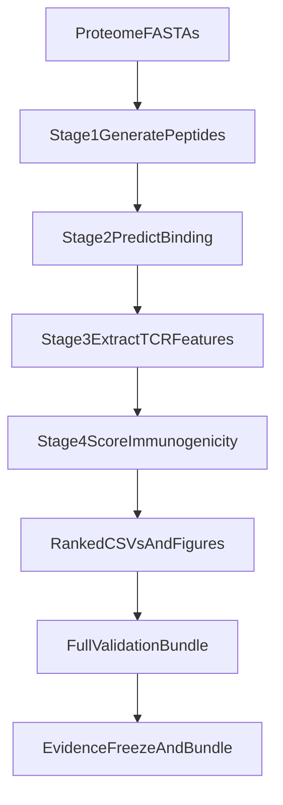

# SESTRAV Master Walkthrough (v1 Prototype)

This is the primary end-to-end walkthrough for SESTRAV v1.
Use this document to run, explain, and present the prototype consistently.

## 1) Scope and Positioning

- SESTRAV v1 is a **computational epitope prioritization prototype**.
- Canonical source: this repository (`main` branch).
- Canonical execution track: 30-feature integrated model path in `config.yaml`.
- Biological claims are bounded by computational validation only (no wet-lab validation in v1).

Reference policy docs:

- `docs/canonical_source_of_truth.md`
- `docs/colloquium_evidence_freeze_v2.md`

## 2) System Architecture



## 3) Inputs and Configuration

Primary configuration file:

- `config.yaml`

Key fields:

- `antigens`: `HPV16_18_panel8`, `EBV_B95_8_panel8`
- `proteome_files`: FASTA mapping for each antigen panel
- `alleles`: canonical 10-allele panel
- `feature_mode`: `30`
- `model_path`: `models/rf_30feature_integrated.joblib`
- `binding_matrix_path`: `models/peptide_binding_matrix.csv`

Training data and model support files:

- `immunogenicity_dataset.csv`
- `models/peptide_binding_matrix.csv`

## 4) Stage-by-Stage Execution

Run from repository root.

### Stage chain via Snakemake (recommended)

```bash
conda run -n sestrav snakemake --snakefile pipeline.smk --cores 4 --forceall
```

This executes:

1. `generate_peptides` -> `results/*_peptides.csv`
2. `predict_binding` -> `results/*_binding.csv`
3. `extract_features` -> `results/*_features.csv`
4. `score_immunogenicity` -> `results/*_ranked.csv` and stage-4 PNGs

### Validation bundle

```bash
conda run -n sestrav snakemake --snakefile pipeline.smk full_validation_report --cores 4 --forceall
```

This regenerates:

- `results/final_validation_report.md`
- `results/h2_tier_a_summary.csv`
- `results/h2_tier_a_summary.md`
- `results/h2_tier_a_fold_metrics.csv`
- `results/gold_standard_validation.csv`
- `results/baseline_comparison.csv`

## 5) Reproducibility and Evidence Freeze

Run tests:

```bash
conda run -n sestrav python -m pytest tests/ -q
```

Build release artifact bundle:

```bash
conda run -n sestrav python -m src.release_bundle --output-dir release_artifacts --bundle-name sestrav-v1
```

Current frozen bundle for this pass:

- `release_artifacts/sestrav-v1-20260424T203715Z.manifest.json`
- `release_artifacts/sestrav-v1-20260424T203715Z.zip`

## 6) How to Interpret Outputs Responsibly

### Ranked outputs (`results/*_ranked.csv`)

- Purpose: prioritize candidates for downstream review, not declare biological efficacy.
- Use as ranking evidence for computational triage.

### Validation outputs

- `final_validation_report.md` provides summary decision framing.
- `h2_tier_a_summary.csv` contains the H2 ratio decision row.
- `gold_standard_validation.csv` confirms known epitope recovery behavior.
- `baseline_comparison.csv` shows integrated model vs binding-only comparator behavior.

### Claim boundary

- Treat results as reproducible computational evidence.
- Do not claim clinical readiness or wet-lab validation.

## 7) Data Mode Handling (IEDB Changes)

If increasing/changing IEDB pool in this prototype version:

- Keep baseline claims tied to frozen Mode A.
- Label new runs as Mode B exploratory.
- Use policy in `docs/iedb_mode_policy.md` before external communication.
- Use naming standards in `docs/output_naming_standard_v1.md`.

## 8) Demo/Presentation Walkthrough Script

1. Show canonical path and policy docs.
2. Show `config.yaml` canonical defaults.
3. Show Snakemake command chain.
4. Open stage outputs (`*_ranked.csv`, stage-4 plots).
5. Open validation bundle and H2 decision.
6. Open evidence freeze and manifest bundle.
7. Close with limitations and collaboration next steps.
