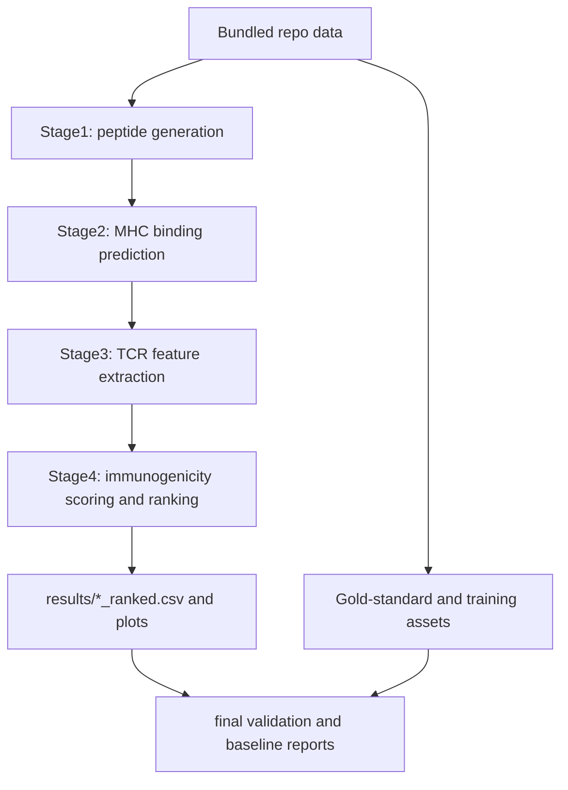

# SESTRAV Final Clarity and Accuracy Audit

Date: 2026-04-22  
Scope: committed code in this repository and current outputs in `results/`.

## 1) Architecture and Input Boundary (How SESTRAV runs)

SESTRAV runs from bundled repository assets and configuration by default:
- Proteomes: `data/proteomes/*.fasta`
- Training/eval tables: `immunogenicity_dataset.csv`, `models/peptide_binding_matrix_v3.csv`
- Workflow config: `config.yaml`
- Model artifact path: `config.yaml -> model_path`

No CLI argument is required to provide custom input data during standard execution:
- `python pipeline.py` iterates through internal `data/proteomes` entries.
- `snakemake --snakefile pipeline.smk --cores N` uses `config["antigens"]` and repository paths.

Mermaid dataflow (source -> transform -> output):

## 2) Stage-by-Stage Output Accuracy Checks (Local snapshot)

Checks performed against current local outputs:
- Required schema presence per stage
- Null checks for critical columns
- Cross-stage row and peptide lineage consistency
- Score/rank integrity checks
- Core tests and workflow wiring checks

### 2.1 Stage contracts and observed status

| Stage | Expected output | Observed status |
|---|---|---|
| Stage 1 | `*_peptides.csv` with `protein_id`, `peptide`, `length`, `start`, `end` | Present for EBV and HPV; only lengths 8/9/10/11 observed |
| Stage 2 | `*_binding.csv` with per-peptide best allele + per-allele bind columns | Present; critical fields non-null (`peptide`, `allele`, `affinity`, `presentation_score`) |
| Stage 3 | `*_features.csv` with Stage 2 columns + feature vector columns | Present; critical fields non-null (`binding_score`, feature columns checked) |
| Stage 4 | `*_ranked.csv` with `immunogenicity_score` and `rank` | Present; score bounds valid [0,1] in snapshot |

### 2.2 Local numeric lineage snapshot

EBV (`EBV_B95_8_panel8`):
- Stage 1 rows: 22,262; unique peptides: 21,002
- Stage 2 rows: 21,002; unique peptides: 21,002
- Stage 3 rows: 21,002
- Stage 4 rows: 21,002
- Lineage checks: Stage1 unique == Stage2 rows == Stage3 rows == Stage4 rows (pass)

HPV (`HPV16_18_panel8`):
- Stage 1 rows: 5,348; unique peptides: 5,347
- Stage 2 rows: 5,347; unique peptides: 5,347
- Stage 3 rows: 5,347
- Stage 4 rows: 5,347
- Lineage checks: Stage1 unique == Stage2 rows == Stage3 rows == Stage4 rows (pass)

Interpretation:
- Stage 1 intentionally includes duplicate peptides from overlapping windows/proteins.
- Stage 2 collapses to one row per unique peptide via best-allele retention while preserving protein provenance fields (`protein_id`, `protein_ids`, `source_protein_count`).

### 2.3 Accuracy findings and remediation performed

Finding A (resolved in code): Stage 4 rank assignment produced sparse/tied integer ranks, causing confusing outputs (example: first HPV rows previously started at rank `9`).
- Root cause: integer-cast of `DataFrame.rank()` on tied scores.
- Fix implemented in `functions/stage4_immunogenicity_scoring.py`:
  - deterministic score sort (`immunogenicity_score` desc, `peptide` asc),
  - contiguous rank assignment `1..N`.
- Stage 4 outputs were regenerated locally after the fix:
  - `EBV_B95_8_panel8_ranked.csv`: rank min/max/unique = `1/21002/21002`
  - `HPV16_18_panel8_ranked.csv`: rank min/max/unique = `1/5347/5347`
- Impact: improves interpretability for top-k reporting and downstream threshold reasoning.

Finding B (migration completed): ambiguous panel stems were renamed.
- Legacy names `HPV_8_FASTAs` / `EBV_8_FASTAs` were replaced with `HPV16_18_panel8` / `EBV_B95_8_panel8`.
- Intermediate name `EBV_panel8_B958` was further renamed to `EBV_B95_8_panel8` to clarify B95-8 strain semantics.
- This removes the likely misread of `8` as a viral strain type.

## 3) EBV/HPV Handling Truth Map (Separated vs pooled)

| Area | Behavior |
|---|---|
| Stage 1-4 production pipeline outputs | Separated per configured proteome ID (`results/{prefix}_...`) |
| Stage 4 model selection | Shared model path from `config.yaml` by default (virus-agnostic scoring) |
| IEDB cleaning/training pool | Pooled across loaded viruses after cleaning and holdout logic |
| SHAP analysis | Pooled by concatenating EBV + HPV features before explanation |
| Baseline report | Per-virus rows plus a Combined summary row |

Conclusion:
- Runtime output files are per-prefix separated.
- Training and some analysis layers are pooled; this needs explicit documentation language in user-facing materials.

## 4) Data Lineage Ledger (Source -> Output)

Primary lineage:
1. `data/proteomes/{prefix}.fasta`
2. `results/{prefix}_peptides.csv` (Stage 1)
3. `results/{prefix}_binding.csv` (Stage 2)
4. `results/{prefix}_features.csv` (Stage 3)
5. `results/{prefix}_ranked.csv` + plots (Stage 4)

Validation lineage:
1. `results/{prefix}_features.csv` + `results/{prefix}_ranked.csv`
2. `src/gold_standard.py` + internal gold standard table
3. `results/gold_standard_validation.csv`

Comparative/report lineage:
1. `results/*_features.csv`, model artifacts in `models/`
2. `src/baseline_comparison.py`, `src/final_validation_report.py`
3. `results/baseline_comparison.csv`, `results/final_validation_report.md`, `results/h2_tier_a_*`

Training lineage:
1. `immunogenicity_dataset.csv` (+ optional `models/peptide_binding_matrix_v3.csv` for 30-feature mode)
2. `src/train_classifier.py`
3. `models/*.joblib`, `models/training_results.csv`, `models/feature_importances.csv`

## 5) Local-run Labeling and Understandability Review

Current labels that are understandable:
- Stage suffixes (`_peptides`, `_binding`, `_features`, `_ranked`) are clear and consistent.
- Validation artifact names (`gold_standard_validation.csv`, `baseline_comparison.csv`) are clear.

Current labels likely to confuse:
- Biological labels can still be confused with file-routing IDs unless docs consistently use `proteome_id` terminology.
- Legacy artifact names may remain in historical files from pre-migration runs.

Recommended naming standard:
- Use `proteome_id`/`panel_id` for run IDs.
- Include explicit antigen-count semantics in names (e.g., suffix `_8ag` or `_panel8`).
- Avoid `"FASTAs"` in singular file identifiers.

## 6) Verification Commands Run

- `python -m pytest tests/test_features.py tests/test_metrics.py tests/test_pipeline_integration.py -q`
  - Result: 20 passed, 0 failed (warnings present for sklearn model version mismatch).
- `snakemake --snakefile pipeline.smk --dry-run --cores 1`
  - Result: DAG valid, nothing pending in current workspace.

## 7) Final Clarity Sign-off Checklist

- [x] Architecture path documented from bundled data to outputs
- [x] Stage-by-stage schema and lineage checks performed
- [x] EBV/HPV separated-vs-pooled behavior documented
- [x] Local-run labeling risks identified
- [x] Concrete accuracy issue fixed (contiguous rank generation)
- [x] Stage 4 artifact files regenerated after rank fix
- [x] Naming migration applied in config/workflow/core docs and runtime scripts
- [x] Terminology harmonized across all historical docs with new canonical names

## 8) Next Recommended Execution Order

1. Sweep remaining historical docs for legacy stem references and tag them as archival.
2. Consider one-release compatibility window, then remove legacy FASTA aliases/files.
3. Export a fresh release manifest after migration-stable outputs are frozen.
4. Freeze updated docs plus migration map for collaborator onboarding.
