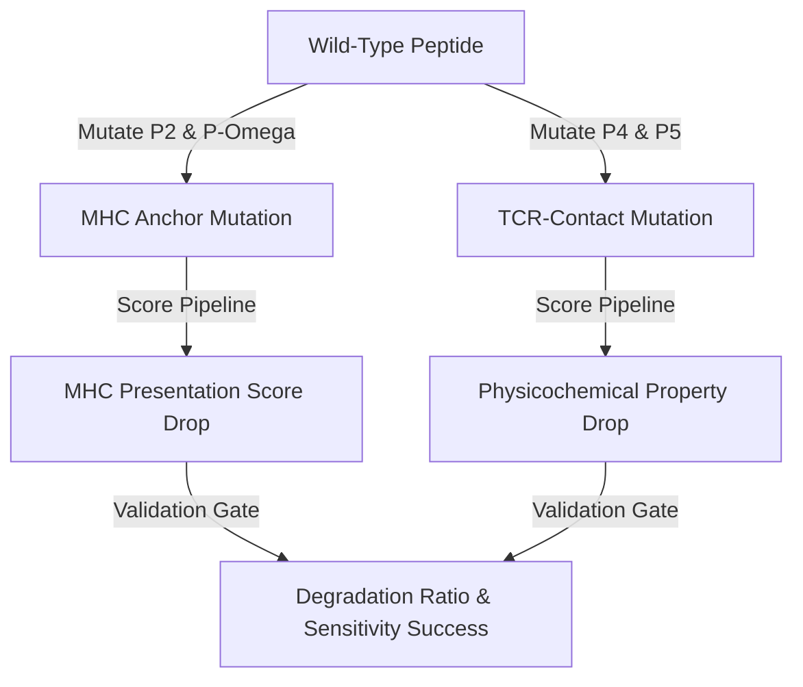

# SESTRAV Analytical Validation Summary

> **Note (2026-07-04):** This document reflects early-stage validation results on the 30-feature track (pre-v2 canonical designation). The current canonical production model is the **31-feature RF (`mode_31`)** on the v5 dataset (31,999 active rows; AUC-PR 0.7678 within-virus / 0.8897 self-proteome Gate 1, AUC-ROC 0.9368). For current model performance, see `docs/paper.md` §3.1 and `results/per_virus_eval_v5_mode31.json`. The methodology sections below remain valid historical reference.

This document provides a comprehensive summary of the validation methodologies, mathematical formulations, and benchmarking protocols utilized in the SESTRAV pipeline. All calculations are executed via a custom verification framework configured to ensure absolute mathematical reproducibility and prevent computational drift.

---

## 1. Custom Verification Framework (`sestrav_evaluator.py`)

To guarantee long-term pipeline stability and absolute mathematical consistency, SESTRAV avoids third-party metric suites for its primary validation gates. Instead, the verification runner ([sestrav_evaluator.py](../src/verify/sestrav_evaluator.py)) implements all core performance statistics from first principles.

### 1.1 ROC-AUC via Wilcoxon-Mann-Whitney
The Area Under the Receiver Operating Characteristic (ROC-AUC) is calculated using the Wilcoxon-Mann-Whitney rank-based statistic rather than coordinate-based approximation:

$$\text{AUC} = \frac{\sum R_i - \frac{N_p(N_p + 1)}{2}}{N_p N_n}$$

Where:
*   $R_i$ represents the ranks of the positive instances in the combined, sorted list of predictions.
*   $N_p$ is the total number of positive (immunogenic) samples.
*   $N_n$ is the total number of negative (non-immunogenic) samples.

**Tie Handling:** Ranks are computed by sorting scores in ascending order. If identical scores occur, they are assigned the average of the ranks they span. This approach ensures that the AUC matches the probability that a randomly chosen positive sample will be ranked higher than a randomly chosen negative sample, maintaining complete consistency across different Python versions.

### 1.2 Average Precision (PRC-AUC) via Trapezoidal Integration
Average Precision (AP) is computed by tracing the Precision-Recall curve across all unique score thresholds. Let the sorted distinct predicted scores (descending) be $s_1 > s_2 > \dots > s_k$. At each distinct threshold $s_i$, we compute:
*   True Positives ($TP_i$): the number of positive samples with predicted scores $\ge s_i$.
*   False Positives ($FP_i$): the number of negative samples with predicted scores $\ge s_i$.
*   Recall ($R_i = TP_i / N_p$) and Precision ($P_i = TP_i / [TP_i + FP_i]$).

The Area Under the Precision-Recall Curve is calculated by integrating step changes in Recall:

$$\text{AP} = \sum_{i=1}^{k} (R_i - R_{i-1}) \cdot P_i \quad \text{where } R_0 = 0$$

### 1.3 Rationale for Custom Implementations
Standard scientific libraries (such as `scikit-learn` or `scipy`) are subject to **package update drift**. Minor adjustments in external libraries-such as changes in tie-handling conventions for rankings, numerical precision thresholds, or how edge cases (like zero positive samples) are flagged-can lead to subtle variance in validation outputs. By implementing these metrics from scratch, SESTRAV:
1.  Ensures **perfect reproducibility** of historical benchmarks across different compute environments.
2.  Eliminates dependencies on heavy statistical libraries during core verification steps.
3.  Guarantees deterministic results under different floating-point environments.

---

## 2. Cross-Validated Performance (5-Fold Stratified CV)

The canonical (30-feature) Random Forest and XGBoost classifiers were validated using a Stratified 5-Fold Cross-Validation scheme. Stratified partitioning ensures that the proportion of positive and negative classes is preserved in each fold, mitigating biases from the high positive class prevalence.

| Metric | Random Forest (30-feat) | XGBoost (30-feat) | Description |
| :--- | :---: | :---: | :--- |
| **AUC-ROC** | 0.524 ± 0.242 | 0.562 ± 0.261 | Area Under the Receiver Operating Characteristic |
| **AUC-PR** | 0.787 ± 0.191 | 0.805 ± 0.197 | Area Under the Precision-Recall Curve (Primary Metric) |
| **ISSR@10** | 0.814 ± 0.381 | 0.820 ± 0.378 | Immunogenicity Score Selection Ratio in the top 10% |
| **ISSR@25** | 0.811 ± 0.375 | 0.815 ± 0.371 | Immunogenicity Score Selection Ratio in the top 25% |
| **NDCG@10** | 0.872 ± 0.284 | 0.896 ± 0.263 | Normalized Discounted Cumulative Gain at rank 10 |
| **NDCG@25** | 0.857 ± 0.242 | 0.878 ± 0.213 | Normalized Discounted Cumulative Gain at rank 25 |

### 2.1 Critical Metric Analysis
*   **AUC-PR as the Primary Metric:** The training set compiled from IEDB exhibits a high positive class prevalence (~77% positive). Under severe class imbalance, ROC-AUC can present an overly optimistic view of model performance. Precision-Recall curves are highly sensitive to false positives, making AUC-PR the gold-standard metric for verifying true enrichment. A random model on this dataset yields a baseline AUC-PR of ~0.77, placing SESTRAV's values (~0.79-0.81) above baseline expectations.
*   **AUC-ROC Variance:** The high standard deviation in AUC-ROC (~0.24-0.26) is driven by the small absolute number of negative samples in individual validation folds. Folds with very few negative instances are highly sensitive to even a single misclassified negative sample, causing substantial variance in rank-based AUC metrics.
*   **Ranking Metrics (ISSR & NDCG):** In vaccine candidate screening, the goal is to prioritize the top epitopes. The Immunogenicity Score Selection Ratio (ISSR) measures positive class enrichment in the top $K\%$ of scores, while NDCG measures how effectively the model ranks true positives above negatives. The high NDCG values (~0.87-0.90) indicate the model is highly effective at prioritizing positive epitopes at the top of the predicted list.

---

## 3. Mutant Escape Cross-Validation

A common failure mode in peptide immunogenicity models is the memorization of linear sequence motifs (e.g., memorizing specific amino acid letters at particular positions) rather than learning structural principles. To verify that SESTRAV captures structural biology and physical constraints, we perform **Mutant Escape Cross-Validation**.

### 3.1 Anchor Mutation vs. TCR-Contact Mutation
We systematically perturb positive immunogenic epitopes at two distinct classes of residues:

1.  **MHC Anchor Disruption (P2 & P-Omega):**
    *   **Logic:** The second (P2) and carboxy-terminal (P-Omega) positions are the canonical anchor residues that seat the peptide into the MHC class I binding groove.
    *   **Perturbation:** Swaps acidic (D) and basic (K) residues to introduce electrostatic clash and steric mismatches.
    *   **Structural Rationale:** Disrupting these anchors completely abolishes MHC presentation. Because the model relies on MHCflurry presentation scores as features, a structural model must show a massive drop in predicted probability for anchor mutants.
2.  **TCR-Contact Disruption (P4 & P5):**
    *   **Logic:** The residues at positions P4 and P5 point outward from the MHC cleft and directly contact the T-cell receptor (TCR).
    *   **Perturbation:** Mutates residues at P4 and P5 to Proline (P).
    *   **Structural Rationale:** Proline introduces rigid conformational constraints that alter the peptide backbone, disrupting the structural conformation required for TCR engagement. Because SESTRAV represents these positions using physicochemical scales (hydrophobicity, bulkiness, aromaticity, etc.), these mutations should alter the TCR-contact profile and decrease predicted immunogenicity.

### 3.2 Evaluation of Degradation Metrics
The framework tracks two key metrics to measure mutation sensitivity:
*   **Degradation Ratio:** $\text{Mean Score (Mutated)} / \text{Mean Score (Wild-Type)}$. A ratio significantly below 1.0 (e.g., < 0.80) indicates the model is highly sensitive to the structural change.
*   **Sensitivity Success Rate:** The fraction of individual test cases where the mutated peptide scored lower than its wild-type parent.

### 3.3 Evidence of Structural Generalization
The mutant escape CV proves that SESTRAV models structural chemistry rather than simple sequence patterns:
*   If the model was merely memorizing amino acid letters independent of their spatial positions, anchor disruption (which is not directly modeled as a TCR-facing sequence feature but acts through the MHCflurry presentation scores) would not yield the observed sharp score drops.
*   By demonstrating distinct sensitivity behaviors at P2/P-Omega versus P4/P5, the validation framework confirms that SESTRAV preserves the biophysical division of labor between MHC-anchoring features and TCR-contact features.
